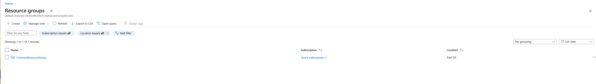

### 小試身手 - 在 Azure 中設計和實施虛擬網路

> **辣個通知** 請先確保您有看過這個影片註冊 Azure Free Account - https://youtu.be/ZsfllNRuErk?si=3q2RHUsL9vrX3ltB

## 情境模擬

現在您已經準備好在 Azure 入口網站中部署虛擬網路。

考慮到 Lagelab 科技公司即將開張，該公司正在將基礎設施和應用程序遷移到 Azure。你身為網絡工程師，你必須計劃並實施三個虛擬網路和子網路，以支持這些虛擬網路中的資源。

**預計時間：** 20 分鐘

**CoreServicesVnet** 主要虛擬網路部署在 **美國東部** 區域。此虛擬網路將擁有最多的資源。它將通過 VPN 連接與本地網路連接。此網路將包含對業務運營至關重要的 Web 服務、資料庫和其他系統。共享服務，如域名控制器和 DNS，也將位於此處。預計會有大量增長，因此此虛擬網路需要一個大的地址空間。

**ManufacturingVnet** 生產虛擬網路部署在 **西歐** 區域，靠近您組織的製造設施所在地。此虛擬網路將包含用於製造設施運營的系統。該組織預計會有大量內部連接設備，用於從系統中檢索數據（如溫度），並且需要一個可以擴展的 IP 地址空間（請設計好子網路遮罩）

**ResearchVnet** 虛擬網路部署在 **東南亞** 區域，靠近組織的研發團隊所在地。研發團隊使用此虛擬網路。該團隊擁有一組穩定的小型資源，預計不會增長。該團隊需要少量 IP 地址來為其工作提供幾台虛擬機器。

## 架構圖

### Lagelab 公司的網路佈局

- **本地：** 10.10.0.0/16
- **ResearchVNet 東南亞：** 10.40.40.0/24
- **CoreServicesVNet 美國東部：** 10.20.0.0/16
- **ManufacturingVNet 西歐：** 10.30.0.0/16

### 您將建立以下資源：

| 虛擬網路       | 區域         | 虛擬網路地址空間 | 子網路                  | 子網路地址範圍 |
|----------------|----------------|-------------------------------|-------------------------|----------------------|
| CoreServicesVnet      | 美國東部        | 10.20.0.0/16                  | GatewaySubnet           | 10.20.0.0/27         |
|                       |                |                               | SharedServicesSubnet    | 10.20.10.0/24        |
|                       |                |                               | DatabaseSubnet          | 10.20.20.0/24        |
|                       |                |                               | PublicWebServiceSubnet  | 10.20.30.0/24        |
| ManufacturingVnet     | 西歐    | 10.30.0.0/16                  | ManufacturingSystemSubnet | 10.30.10.0/24        |
|                       |                |                               | SensorSubnet1           | 10.30.20.0/24        |
|                       |                |                               | SensorSubnet2           | 10.30.21.0/24        |
|                       |                |                               | SensorSubnet3           | 10.30.22.0/24        |
| ResearchVnet          | 東南亞 | 10.40.0.0/16                  | ResearchSystemSubnet    | 10.40.0.0/24         |

這些虛擬網路和子網路的結構既能容納現有資源，又能適應預期的增長。讓我們建立這些虛擬網路和子網路，為我們的網路基礎設施奠定基礎。

### 在此練習中，您將：

1. **任務 1：** 建立 Contoso 資源群組
2. **任務 2：** 建立 CoreServicesVnet 虛擬網路和子網路
3. **任務 3：** 建立 ManufacturingVnet 虛擬網路和子網路
4. **任務 4：** 建立 ResearchVnet 虛擬網路和子網路
5. **任務 5：** 驗證 VNet 和子網路的建立

### 任務 1：建立 Contoso 資源群組

1. 前往 [Azure 入口網站](https://portal.azure.com/)。
2. 在首頁上，於 Azure 服務下選擇 **資源群組**。
3. 在資源群組中，選擇 **+ 建立**。
4. 使用以下表格中的信息來建立資源群組。

| 標籤            | 選項               | 值                  |
|----------------|----------------------|------------------------|
| 基本         | 資源群組       | ContosoResourceGroup   |
|                | 區域               | (美國) 美國東部           |
| 標籤           | 無需更改  |                        |
| 檢閱 + 建立| 檢閱您的設定並選擇 **建立** | |

5. 在資源群組中，確認 **ContosoResourceGroup** 出現在列表中。

### 任務 2：建立 CoreServicesVnet 虛擬網路和子網路

1. 在 Azure 入口網站首頁上，導航到 **全域搜尋欄** 並搜尋 **虛擬網路**，然後在服務下選擇 **虛擬網路**。

2. 在虛擬網路頁面上選擇 **建立**。
3. 使用以下表格中的信息來建立 **CoreServicesVnet** 虛擬網路。

| 標籤            | 選項               | 值                  |
|----------------|----------------------|------------------------|
| 基本         | 資源群組       | ContosoResourceGroup   |
|                | 名稱                 | CoreServicesVnet       |
|                | 區域               | (美國) 美國東部           |
| IP 位址   | IPv4 位址空間   | 10.20.0.0/16           |

4. 使用以下表格中的信息來建立 **CoreServicesVnet** 子網路。

| 子網路                  | 選項               | 值                  |
|-------------------------|----------------------|------------------------|
| GatewaySubnet           | 子網路名稱          | GatewaySubnet          |
|                         | 子網路位址範圍 | 10.20.0.0/27           |
| SharedServicesSubnet    | 子網路名稱          | SharedServicesSubnet   |
|                         | 子網路位址範圍 | 10.20.10.0/24          |
| DatabaseSubnet          | 子網路名稱          | DatabaseSubnet         |
|                         | 子網路位址範圍 | 10.20.20.0/24          |
| PublicWebServiceSubnet  | 子網路名稱          | PublicWebServiceSubnet |
|                         | 子網路位址範圍 | 10.20.30.0/24          |

5. 要完成 **CoreServicesVnet** 及其相關子網路的建立，請選擇 **檢閱 + 建立**。
6. 確認您的配置通過驗證，然後選擇 **建立**。
7. 根據以下表格，重複步驟 1 - 8 為每個 VNet 建立。

### 任務 3：建立 ManufacturingVnet 虛擬網路和子網路

| 標籤            | 選項               | 值                  |
|----------------|----------------------|------------------------|
| 基本         | 資源群組       | ContosoResourceGroup   |
|                | 名稱                 | ManufacturingVnet      |
|                | 區域               | (歐洲) 西歐   |
| IP 位址   | IPv4 位址空間   | 10.30.0.0/16           |

| 子網路                  | 選項               | 值                  |
|-------------------------|----------------------|------------------------|
| ManufacturingSystemSubnet | 子網路名稱          | ManufacturingSystemSubnet |
|                         | 子網路位址範圍 | 10.30.10.0/24          |
| SensorSubnet1           | 子網路名稱          | SensorSubnet1          |
|                         | 子網路位址範圍 | 10.30.20.0/24          |
| SensorSubnet2           | 子網路名稱          | SensorSubnet2          |
|                         | 子網路位址範圍 | 10.30.21.0/24          |
| SensorSubnet3           | 子網路名稱          | SensorSubnet3          |
|                         | 子網路位址範圍 | 10.30.22.0/24          |

### 任務 4：建立 ResearchVnet 虛擬網路和子網路

| 標籤            | 選項               | 值                  |
|----------------|----------------------|------------------------|
| 基本         | 資源群組       | ContosoResourceGroup   |
|                | 名稱                 | ResearchVnet           |
|                | 區域               | 東南亞         |
| IP 位址   | IPv4 位址空間   | 10.40.0.0/16           |

| 子網路                  | 選項               | 值                  |
|-------------------------|----------------------|------------------------|
| ResearchSystemSubnet    | 子網路名稱          | ResearchSystemSubnet   |
|                         | 子網路位址範圍 | 10.40.0.0/24           |

### 任務 5：驗證 VNet 和子網路的建立

1. 在 Azure 入口網站首頁上，選擇 **所有資源**。
2. 確認 **CoreServicesVnet**、**ManufacturingVnet** 和 **ResearchVnet** 已列出。
3. 選擇 **CoreServicesVnet**。
4. 在 **CoreServicesVnet** 中，於 **設定** 下選擇 **子網路**。
5. 在 **CoreServicesVnet | 子網路** 中，確認您建立的子網路已列出，並且 IP 位址範圍正確。
6. 重複步驟 3 - 5 為每個 VNet 進行驗證。

## 使用 Copilot 擴展學習

Copilot 可以幫助您學習如何使用 Azure 腳本工具。Copilot 還可以協助處理實驗室未涵蓋的領域或您需要更多信息的地方。打開 Edge 瀏覽器並選擇 **Copilot**（右上角）或導航到 [copilot.microsoft.com](https://copilot.microsoft.com)。花幾分鐘嘗試以下提示：

- 您能否提供一個實際場景中使用 10.30.0.0/16 IP 位址的示例？
- 在美國東部區域建立一個名為 **CoreServicesVnet** 的虛擬網路的 Azure PowerShell 命令是什麼？該虛擬網路應使用 10.20.0.0/16 IP 位址空間。
- 在西歐區域建立一個名為 **ManufacturingVnet** 的虛擬網路的 Azure CLI 命令是什麼？該虛擬網路應使用 10.30.0.0/16 IP 位址空間。

## 通過自學培訓了解更多

- **為您的 Azure 部署設計 IP 位址方案。** 在此模組中，識別 Azure 虛擬網路的公共和私有 IP 位址功能。
- **Azure 虛擬網路簡介。** 在此模組中，您將學習如何設計和實施 Azure 網路服務。您將了解虛擬網路、公共和私有 IP、DNS、虛擬網路對等互連、路由和 Azure 虛擬 NAT。

## 關鍵要點

- **Azure 虛擬網路** 是一項服務，為您在 Azure 中的私有網路提供基礎構建塊。該服務的實例（虛擬網路）使許多類型的 Azure 資源能夠安全地相互通信、與互聯網通信以及與本地網路通信。確保不重疊的位址空間。確保您的虛擬網路位址空間（CIDR 塊）不與您組織的其他網路範圍重疊。
- 虛擬網路中的所有 Azure 資源都部署到虛擬網路內的子網路中。子網路使您能夠將虛擬網路分割成一個或多個子網路，並為每個子網路分配虛擬網路位址空間的一部分。您的子網路不應覆蓋虛擬網路的整個位址空間。提前計劃並為未來保留一些位址空間。

## 技術點

* 什麼是 vNet?
* 什麼是子網路遮罩？