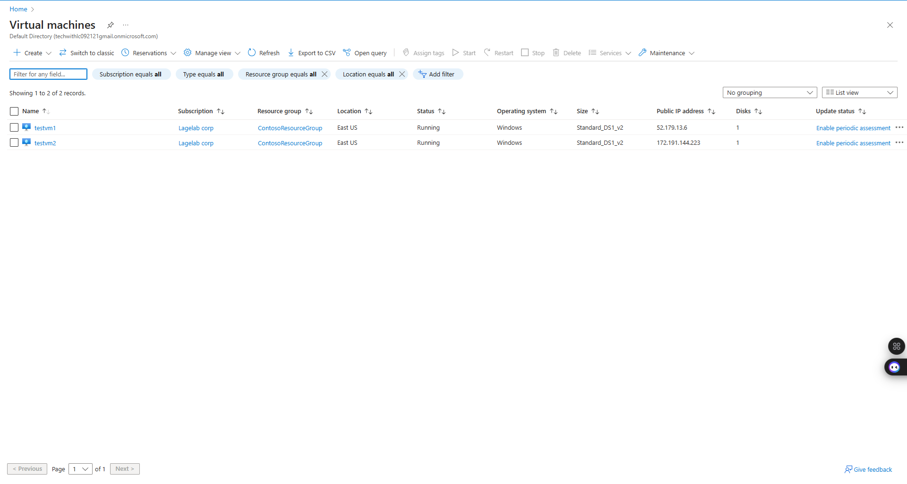

# M01 - 單元 6 在 Azure 中設定 DNS

# M01 - Unit 6 Configure DNS settings in Azure

## 演習場景

在本單元中，您將為 Contoso Ltd. 設定 DNS 名稱解析。您將建立一個名為 contoso.com 的私有 DNS 區域，連結 VNet 以進行註冊和解析，然後建立兩台虛擬機器並測試設定。

## 架構圖


**預計時間：** 25 分鐘

### 在本練習中，您將：

**任務 1：** 建立一個私有 DNS 區域

**任務 2：** 連結子網路以進行自動註冊

**任務 3：** 建立虛擬機器以測試設定

**任務 4：** 驗證 DNS 區域中存在記錄

-----

> **重要提示：** 此練習需要前一個實驗室的虛擬網路。這可以使用**範本**檔案進行安裝。所有虛擬網路都將被安裝，但只需要 CoreServicesVNet。


-----

### 任務 1：建立一個私有 DNS 區域

1.  前往 **Azure 入口網站**。
2.  在 Azure 首頁的搜尋欄中，輸入 **dns**，然後選擇 **私有 DNS 區域**。
3.  在私有 DNS 區域中，選擇 **+ 建立**。
4.  使用下表中的資訊來建立私有 DNS 區域。

| 索引標籤 | 選項 | 值 |
| :--- | :--- | :--- |
| **基本** | 資源群組（如果需要，請建立新的） | ContosoResourceGroup |
| | 名稱 | Contoso.com |
| **檢閱 + 建立** | 檢閱您的設定並選擇 **建立** | |


5.  等待部署完成，然後選擇 **前往資源**。
6.  驗證該區域已建立。


-----

### 任務 2：連結子網路以進行自動註冊

1.  在 **Contoso.com** 中，於 **DNS 管理** 下，選擇 **虛擬網路連結**。
2.  在 Contoso.com | 虛擬網路連結上，選擇 **+ 新增**。
3.  使用下表中的資訊來新增虛擬網路連結。

| 選項 | 值 |
| :--- | :--- |
| 連結名稱 | CoreServicesVnetLink |
| 訂閱 | 無需變更 |
| 虛擬網路 | CoreServicesVnet (ContosoResourceGroup) |
| 啟用自動註冊 | 已選取 |
| 檢閱您的設定並選擇 **確定**。 | |


4.  選擇 **重新整理**。
5.  驗證 **CoreServicesVnetLink** 已建立，並且自動註冊已啟用。


-----

### 任務 3：建立虛擬機器以測試設定

在本節中，您將建立兩台測試 VM 來測試私有 DNS 區域的設定。

1.  在 Azure 入口網站中，選擇 **Cloud Shell** 圖示（右上角）。如果需要，請設定 shell。
2.  選擇 **PowerShell**。
3.  選擇 **無需儲存帳戶** 和您的 **訂閱**，然後選擇 **套用**。
4.  等待終端機建立並顯示提示。
5.  在 Cloud Shell 窗格的工具列中，選擇 **管理檔案** 圖示，在下拉式選單中選擇 **上傳**，然後上傳範本檔案：**azuredeploy.json** 和 **azuredeploy.parameters.json**。
    > **注意：** 如果您在自己的訂閱中工作，範本檔案可在 GitHub 實驗室儲存庫中找到。
6.  部署以下 ARM 範本以建立此練習所需的 VM：
    > **注意：** 系統將提示您提供管理員密碼。您將在稍後的步驟中需要此密碼。
    ```powershell
    $RGName = "ContosoResourceGroup"

    New-AzResourceGroupDeployment -ResourceGroupName $RGName -TemplateFile azuredeploy.json -TemplateParameterFile azuredeploy.parameters.json
    ```


7.  部署完成後，前往 Azure 入口網站首頁，然後選擇 **虛擬機器**。
8.  驗證兩台虛擬機器都已建立。



-----

### 任務 4：驗證 DNS 區域中存在記錄

1.  在 Azure 入口網站首頁上，選擇 **私有 DNS 區域**。
2.  在私有 DNS 區域中，選擇 **contoso.com**。
3.  驗證兩台 VM 的主機 (A) 記錄都已列出，如下所示：
4.  記下 VM 的名稱和 IP 位址。


#### 連線至 VM 以測試名稱解析

1.  在 Azure 入口網站首頁上，選擇 **虛擬機器**。
2.  選擇 **TestVM1**。
3.  在 TestVM1 上，選擇 **連線 \> 連線** 並下載 RDP 檔案。確保檔案成功下載。


4.  找到 RDP 檔案並雙擊執行該檔案。
5.  選擇 **連線** 並提供您在範本部署期間提供的 **TestUser** 密碼。


6.  在警告頁面上選擇 **確定**，然後選擇 **是**。


7.  在 TestVM1 上，開啟命令提示字元並輸入命令 `ipconfig /all`。
8.  請注意 IP 位址與 DNS 區域中的位址相同。
9.  輸入命令 `ping TestVM2.contoso.com`。由於 VM 上啟用了 Windows 防火牆，此命令將會逾時。
10. 相反，使用 `nslookup TestVM2.contoso.com` 命令來驗證您是否收到 VM2 的成功名稱解析記錄。這展示了私有區域的名稱解析。


-----

## 擴展學習

### 什麼是 Azure DNS 和 Azure 私有 DNS 之間的區別？提供何時使用 Azure 私有 DNS 的範例。

| 項目 | **Azure DNS** (公有) | **Azure 私有 DNS** |
| :--- | :--- | :--- |
| **定義** | 一項用於託管公有 DNS 網域的服務，讓全球網際網路使用者可以解析您的網域名稱。 | 在您的虛擬網路 (VNet) 中提供一個私有且安全的名稱解析服務，僅限於指定的 VNet 存取。 |
| **流量路徑** | 流量來自於公用網際網路，解析結果對全球公開。 | 流量完全保留在您的私有網路中，不暴露於公用網際網路，確保更高的安全性與隱私。 |
| **使用案例** | 託管公司網站 (例如 `www.contoso.com`)、郵件伺服器或其他需要從外部網路存取的服務。 | 適用於 VNet 內的虛擬機器、應用程式或其他資源之間的內部名稱解析，例如解析資料庫伺服器的主機名 `db.corp.contoso.com`。 |
| **範例** | 當您希望客戶能透過瀏覽器訪問您的線上商店時，您會使用 Azure 公有 DNS。 | 當您的 Web 應用程式需要連接到同一 VNet 中的後端資料庫時，您可以使用 Azure 私有 DNS，這樣就無需使用 IP 位址，提高了可管理性。 |

### 建立 Azure DNS 區域時，自動註冊的目的是什麼？

**自動註冊** (Auto-registration) 的主要目的是**簡化和自動化 DNS 記錄的管理**。當您將一個虛擬網路連結到一個私有 DNS 區域並啟用自動註冊後，該虛擬網路中的虛擬機器（VM）的 DNS 記錄將會**自動建立、更新和刪除**。

具體來說，它有以下好處：

  * **自動建立：** 當一個新的 VM 在該 VNet 中啟動時，其主機名和私有 IP 位址會自動註冊到私有 DNS 區域中。
  * **自動更新：** 如果 VM 的 IP 位址發生變更，DNS 記錄會自動更新。
  * **自動刪除：** 當 VM 被刪除或停止（取消分配）時，其對應的 DNS 記錄也會被自動移除。

這消除了手動管理 DNS A 記錄的需要，減少了人為錯誤的風險，並確保了 DNS 資訊始終與您 VNet 中的資源狀態保持同步，特別適用於動態擴展和變動的雲端環境。

-----

## 透過自主學習模式學習更多

  * [**Azure DNS 簡介**](https://learn.microsoft.com/zh-tw/training/modules/intro-to-azure-dns/)。此模組解釋了 Azure DNS 的功能、運作方式，以及何時應選擇使用 Azure DNS 作為滿足組織需求的解決方案。
  * [**在 Azure DNS 上託管您的網域**](https://learn.microsoft.com/zh-tw/training/modules/host-domain-azure-dns/)。在此模組中，您將建立一個 DNS 區域和 DNS 記錄，以將網域對應到 IP 位址。您還將進行測試，以確保網域名稱能解析到您的網頁伺服器。

-----

## 關鍵要點

恭喜您完成本實驗室。以下是本實驗室的主要要點。

  * **Azure DNS** 是一項雲端服務，可讓您託管和管理網域名稱系統 (DNS) 網域，也稱為 DNS 區域。
  * **Azure DNS 公有區域** 託管您打算讓網際網路上任何主機解析的記錄的網域名稱區域資料。
  * **Azure 私有 DNS 區域** 可讓您為私有 Azure 資源設定一個私有的 DNS 區域命名空間。
  * **DNS 區域** 是 DNS 記錄的集合。DNS 記錄提供有關網域的資訊。
