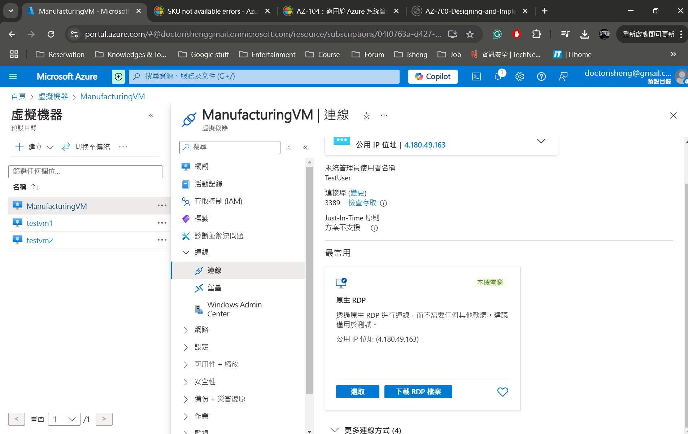
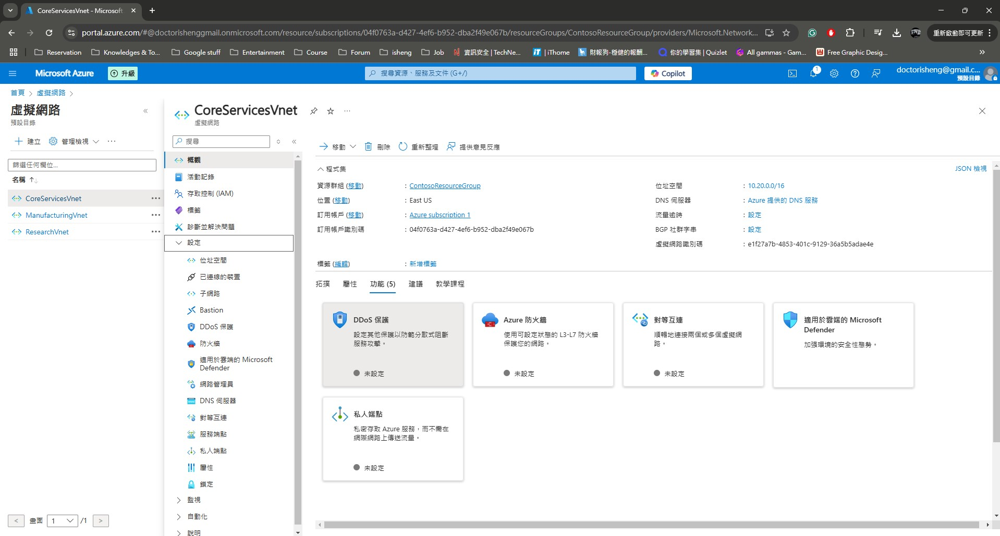

### 小試身手 - 在 Azure 中設計和實施虛擬網路

> **辣個通知** 請先確保您有看過這個影片註冊 Azure Free Account - https://youtu.be/ZsfllNRuErk?si=3q2RHUsL9vrX3ltB

## 情境模擬

現在您已經準備好在 Azure 入口網站中部署虛擬網路。

考慮到不同區域公司分部即將開張，該公司正在將基礎設施和應用程序遷移到 Azure。你身為網絡工程師，你必須計劃並實施兩個虛擬網路進行peering對等連接


**預計時間：** 20 分鐘

**CoreServicesVnet** (10.20.0.0/16) 虛擬網路部署在 **美國東部** 區域，為公司總部區域。此虛擬網路內有TestVM1 (10.20.20.4)。

**ManufacturingVnet** (10.30.0.0/16) 虛擬網路部署在 **西歐** 區域，為新公司區域。此虛擬網路將包含用於製造設施運營的系統。該組織預計會有大量內部連接設備。此虛擬網路內有ManufactorungVM (10.30.10.4)。

## 架構圖


### 公司的網路佈局
### 您將建立以下資源：
**TestVM1(美東)**、**ManufactoringVM(西歐)**、**Peering對等連接**

### 在此練習中，您將：

1. **任務 1：** 建立虛擬機器來測試配置
2. **任務 2：** 使用 RDP 連接到測試虛擬機
3. **任務 3：** 測試虛擬機器之間的連接
4. **任務 4：** 在 CoreServicesVnet 和 ManufacturingVnet 之間建立 VNet 對等互連
5. **任務 5：** 測試虛擬機器之間的連接

### 任務 1：建立虛擬機器來測試配置

1. 在 Azure 入口網站中，選擇 Cloud Shell 圖示（右上角）。 如果有必要，請配置 shell。 
    
    + 選擇 **PowerShell**。
    
    + 選擇 **「不需要儲存帳戶」** 和您的 **訂閱**，然後選擇 **「套用」**。
    
    + 等待終端機建立並顯示提示。 

### 建立 TestVM1 
2. 在 Cloud Shell 窗格的工具列上，選擇「管理檔案」圖標，在下拉式選單中選擇 **「上傳」** ，並將下列檔案**azuredeploy.json**和**azuredeploy.parameters.json**從來源資料夾**F:\Allfiles\Exercises\M01**上傳至 Cloud Shell 主目錄。

   >**注意**: 
   + 檔案下載網址: https://github.com/MicrosoftLearning/AZ-700-Designing-and-Implementing-Microsoft-Azure-Networking-Solutions/archive/master.zip
    
   部署以下 ARM 範本來建立此練習所需的 VM： (複製以下code至powershell執行)

   >**注意**: 系統將提示您提供管理員密碼。 (需要 **設定大小寫特殊符號**之密碼，ex:Admin1234!) 
   ```powershell
   $RGName = "ContosoResourceGroup"
   New-AzResourceGroupDeployment -ResourceGroupName $RGName -TemplateFile azuredeploy.json -TemplateParameterFile azuredeploy.parameters.json
   ```

### 建立 ManufacturingVM
3. 在 Cloud Shell 窗格的工具列上，選擇「管理檔案」圖標，在下拉式選單中選擇 **「上傳」** ，並將下列檔案**ManufacturingVMazuredeploy.json**和**ManufacturingVMazuredeploy.parameters.json**從來源資料夾**F:\Allfiles\Exercises\M011**上傳至 Cloud Shell 主目錄。

   >**注意**: 
   + 檔案下載網址: https://github.com/MicrosoftLearning/AZ-700-Designing-and-Implementing-Microsoft-Azure-Networking-Solutions/archive/master.zip
   + 再上傳前需修改**ManufacturingVMazuredeploy.json**和**ManufacturingVMazuredeploy.parameters.json**內vmsize value為 **Standard_D2ls_v5**
    
   部署以下 ARM 範本來建立此練習所需的 VM： (複製以下code至powershell執行)

   >**注意**: 系統將提示您提供管理員密碼。 (需要 **設定大小寫特殊符號**之密碼，ex:Admin1234!) 
   ```powershell
   $RGName = "ContosoResourceGroup"
   New-AzResourceGroupDeployment -ResourceGroupName $RGName -TemplateFile ManufacturingVMazuredeploy.json -TemplateParameterFile ManufacturingVMazuredeploy.parameters.json
   ```

4. 部署完成後，請前往 Azure 入口網站主頁，然後選擇 **「虛擬機器」**。
5. 驗證虛擬機器是否已建立。

### 任務 2：使用 RDP 連接到測試虛擬機

1.在 Azure 入口網站首頁上，選擇 **「虛擬機器」**。

2.選擇 **ManufacturingVM**。


3.在 ManufacturingVM 上，選擇 **「連線」>「RDP」**。

4.關於 ManufacturingVM |連接，選擇 **下載 RDP 檔案**。



5.將 RDP 檔案儲存到您的桌面。

6.使用 RDP 檔案以及部署期間提供的使用者名稱TestUser和密碼連線到 ManufacturingVM。

   >**注意**: 密碼為先前建立VM時設定之密碼。

7.在 Azure 入口網站首頁上，選擇 **「虛擬機器」**。

8.選擇 **TestVM1**。

9.在 TestVM1 上，選擇 **「連線」>「RDP」**。

10.在 TestVM1 上|連接，選擇 **下載 RDP 檔案**。


11.將 RDP 檔案儲存到您的桌面。

12.使用 RDP 檔案以及您在部署期間提供的使用者名稱TestUser和密碼連線到 TestVM1。

   >**注意**: 密碼為先前建立VM時設定之密碼。

13.在兩台虛擬機器上的「選擇裝置的隱私設定」中，選擇「接受」。

14.在兩台虛擬機器上的「網路」中，選擇「是」。

15.分別在ManufacturingVM、TestVM1 上，開啟 PowerShell 提示字元並執行下列命令：ipconfig


16.記下 IPv4 位址。


### 任務 3：測試虛擬機器之間的連接

1.在 ManufacturingVM 上，開啟 PowerShell 提示字元。

2.使用下列命令驗證沒有與 CoreServicesVnet 上的 TestVM1 的連線。確保使用 TestVM1 的 IPv4 位址。

   ```powershell
    Test-NetConnection 10.20.20.4 -port 3389
    ```

3.測試連線應該會失敗，您將看到類似以下內容的結果：


### 任務 4：在 CoreServicesVnet 和 ManufacturingVnet 之間建立 VNet 對等互連

1.在 Azure 主頁上，選擇「虛擬網路」，然後選擇「CoreServicesVnet」。



2.在 CoreServicesVnet 中的「設定」下，選擇「Peerings」。

3.在 CoreServicesVnet 上 |對等連接，選擇+ 新增。


4.使用此資訊來建立對等。完成後，選擇新增。
   
   **遠端虛擬網路摘要**

   | **選項**                                    | **輸入值**                             |
   | ------------------------------------ | --------------------------------------------- | 
   | 對等連結名稱  | `ManufacturingVnet-to-CoreServicesVnet` |
   | 虛擬網路 | ManufacturingVnet |

    **遠端虛擬網路對等設定**
   
   | **選項**                                    | **輸入值**                             |
   | ------------------------------------ | --------------------------------------------- | 
   | 允許 'ManufacturingVnet' 存取 'CoreServicesVnet' | 啟用 |
   |'ManufacturingVnet' 接收來自 'CoreServicesVnet'的轉送流量 | 啟用 |
 
    **本地虛擬網路摘要**

    | **選項**                                    | **輸入值**                             |
    | ------------------------------------ | --------------------------------------------- | 
    | 對等連結名稱 | `CoreServicesVnet-to-ManufacturingVnet` |
 
    **遠端虛擬網路對等設定**
   
    | **選項**                                    | **輸入值**                             |
    | ------------------------------------ | --------------------------------------------- | 
    | 允許 'CoreServicesVnet' to access 'ManufacturingVnet' | 啟用
    | 允許 'CoreServicesVnet' 接收來自 from 'ManufacturingVnet' | 啟用 |

**如以下附圖**


5.在 CoreServicesVnet 中 |對等連接，驗證CoreServicesVnet 到 ManufacturingVnet 對等連接是否已連接。

6.在「虛擬網路」下，選擇ManufacturingVnet，並驗證ManufacturingVnet-to-CoreServicesVnet 對等連線是否已連線。


### 任務 5：測試虛擬機器之間的連接

1. 在 Azure 入口網站首頁上，選擇 **所有資源**。
2. 確認 **CoreServicesVnet**、**ManufacturingVnet** 和 **ResearchVnet** 已列出。


3. 在所有的 Vnet 中，於 **設定** 下選擇 **子網路**，確認您建立的子網路已列出，並且 IP 位址範圍正確。
4. 重複步驟 3 - 5 為每個 VNet 進行驗證。

## 使用 Copilot 牛刀小試

Copilot 可以幫助您學習如何使用 Azure 腳本工具。Copilot 還可以協助處理實驗室未涵蓋的領域或您需要更多信息的地方。打開 Edge 瀏覽器並選擇 **Copilot**（右上角）或導航到 [copilot.microsoft.com](https://copilot.microsoft.com)。花幾分鐘嘗試以下提示：

- 您能否提供一個實際場景中使用 10.30.0.0/16 IP 位址的示例？
- 在美國東部區域建立一個名為 **CoreServicesVnet** 的虛擬網路的 Azure PowerShell 命令是什麼？該虛擬網路應使用 10.20.0.0/16 IP 位址空間，可以嘗試一下 Copilot 回的 Powershell command 能不能用


- 在西歐區域建立一個名為 **ManufacturingVnet** 的虛擬網路的 Azure CLI 命令是什麼？該虛擬網路應使用 10.30.0.0/16 IP 位址空間。


## 關鍵要點

- **Azure 虛擬網路** 是一項服務，為您在 Azure 中的私有網路提供基礎構建塊。該服務的實例（虛擬網路）使許多類型的 Azure 資源能夠安全地相互通信、與互聯網通信以及與本地網路通信。確保不重疊的位址空間。確保您的虛擬網路位址空間（CIDR 塊）不與您組織的其他網路範圍重疊。
- 虛擬網路中的所有 Azure 資源都部署到虛擬網路內的子網路中。子網路使您能夠將虛擬網路分割成一個或多個子網路，並為每個子網路分配虛擬網路位址空間的一部分。您的子網路不應覆蓋虛擬網路的整個位址空間。提前計劃並為未來保留一些位址空間。


## 技術學習補充

* [什麼是 Azure Virtual Network?](https://learn.microsoft.com/en-us/training/modules/introduction-to-azure-virtual-networks/2-explore-azure-virtual-networks)
* [什麼是子網路遮罩？](https://aws.amazon.com/tw/what-is/cidr/)