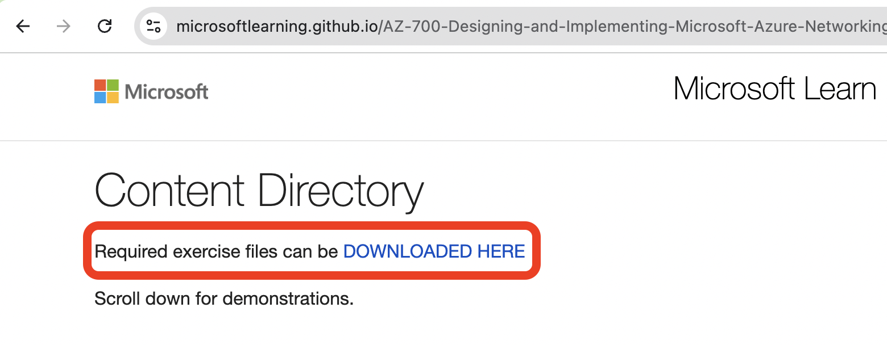
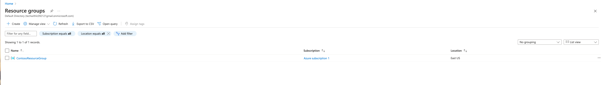
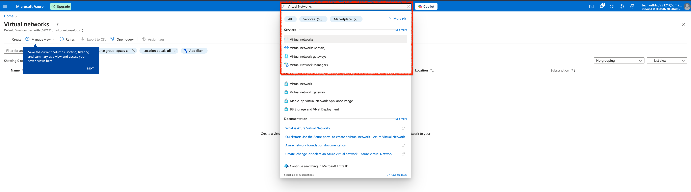
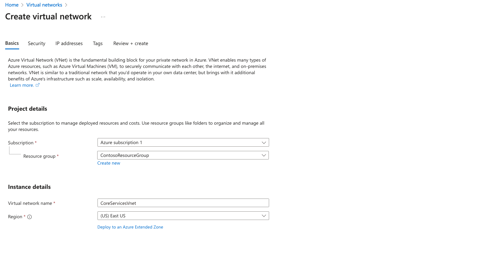
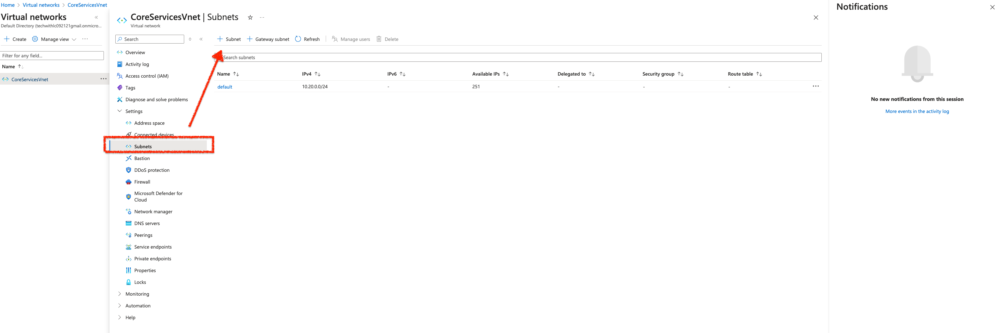
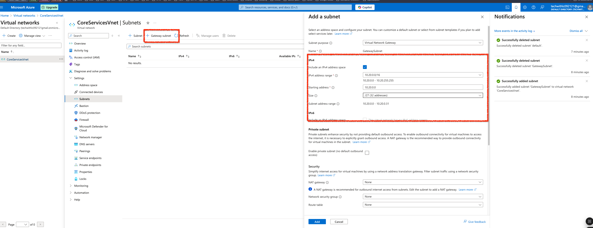
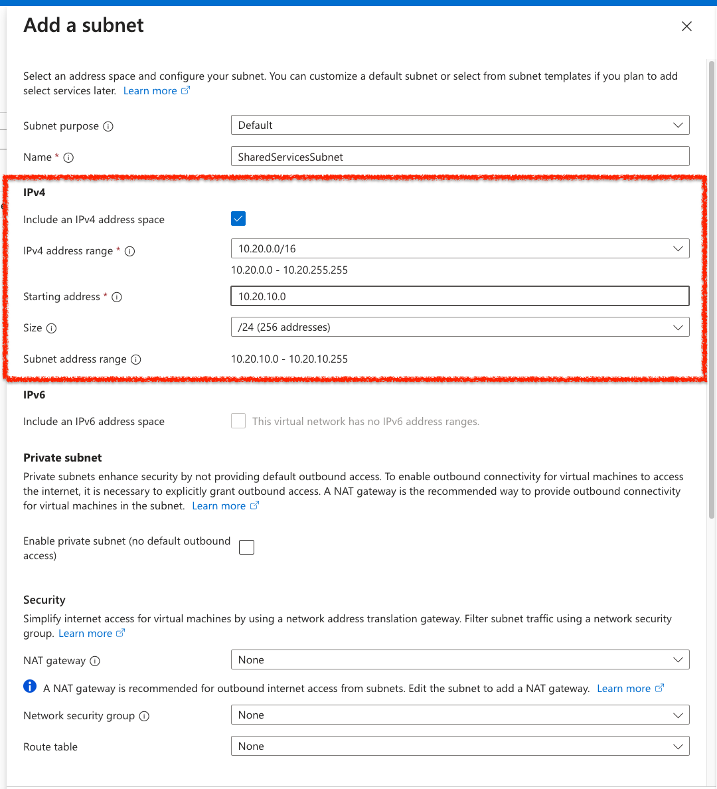
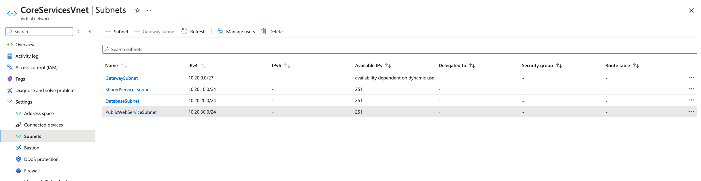
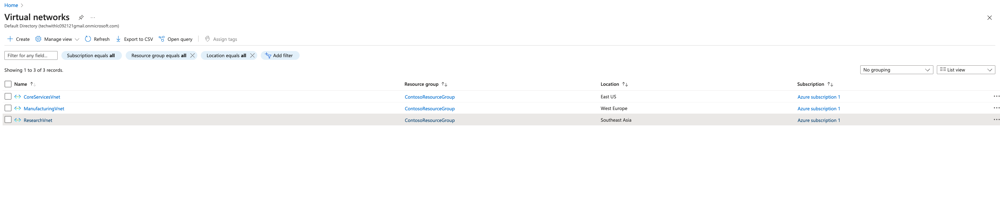
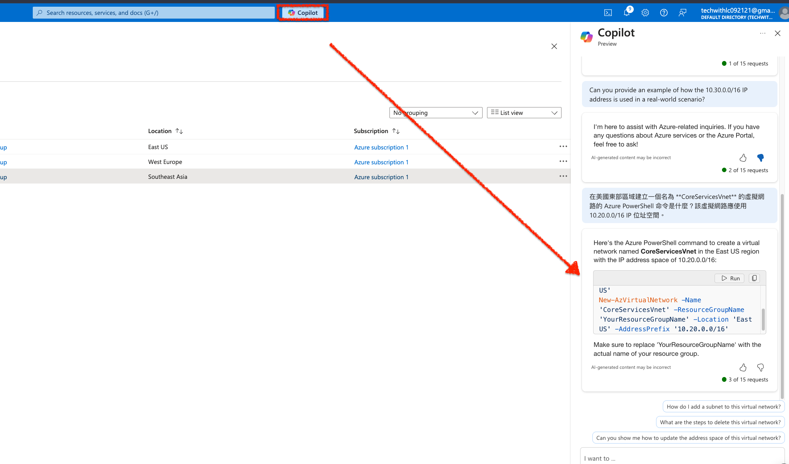

### Unit 3 - 在 Azure 中設計和實施虛擬網路匣道(Virtual Network Gateway - VNG)

## 情境模擬

現在您已經準備好在 Azure 入口網站中部署虛擬網路匣道(Virtual Network Gateway - VNG)。

連接 Lagelab 科技公司的核心服務 VNET 與 製造商 LageMan 的 VNET。

**預計時間：** x0 分鐘

**CoreServicesVnet** 。

**ManufacturingVnet** 

**ResearchVnet** 。

## 架構圖

### Lagelab 公司的網路佈局

- **CoreServicesVNet 美國東部：** 10.20.0.0/16
- **ManufacturingVNet 北歐：** 10.30.0.0/16

### 您將建立以下資源：

| 虛擬網路       | 區域         | 虛擬網路地址空間 | 子網路                  | 子網路地址範圍 |
|----------------|----------------|-------------------------------|-------------------------|----------------------|
| CoreServicesVnet      | 美國東部        | 10.20.0.0/16                  | GatewaySubnet           | 10.20.0.0/27         |
|                       |                |                               | DatabaseSubnet          | 10.20.20.0/24        |
| ManufacturingVnet     | 北歐    | 10.30.0.0/16                  | GatewaySubnet | 10.30.0.0/27        |
|
|                       |                |                               | Manu*SystemSubnet           | 10.30.10.0/24        |

這些虛擬網路和子網路的結構既能容納現有資源，又能適應預期的增長。讓我們建立這些虛擬網路和子網路，為我們的網路基礎設施奠定基礎。

### 在此練習中，您將：

1. **任務 1：** 建立 CoreServicesVnet 與 ManufacturingVnet 虛擬網路
2. **任務 2：** 建立 CoreServicesVM 虛擬機
3. **任務 3：** 建立 ManufacturingVM 虛擬機
4. **任務 4：** 使用 RDP 連線到虛擬機
5. **任務 5：** 測試虛擬機之間的連線
6. **任務 6：** 建立 CoreServicesVnet Gateway
7. **任務 7：** 建立 ManufacturingVnet Gateway
8. **任務 8：** 從 CoreServicesVnet 連線到 ManufacturingVnet
9. **任務 9：** 從 ManufacturingVnet 連線到 CoreServicesVnet
10. **任務 10：** 驗證連線是成功的
11. **任務 11：** 測試虛擬機之間的連線

### 預估時間 70 分鐘 (包含 ~45 分鐘等待佈建)

### 1：建立 CoreServicesVnet 與 ManufacturingVnet 虛擬網路

1. 前往 [Azure 入口網站] 點選 Cloud Shell 按鈕(在畫面右上)，如果需要設定 Shell。
- * 選 PowerShell
- * 選 No Storage Account required 與你的訂閱，點套用(Apply)。
- * 等待指令介面建立，出現提示字元。

2. 上傳 azuredeploy.json 和 azuredeploy.parameters.json，檔案下載處請參考下圖。

### 以下待更新
3. 在資源群組中，選擇 **+ 建立**。
4. 使用以下表格中的信息來建立資源群組。

| 標籤            | 選項               | 值                  |
|----------------|----------------------|------------------------|
| 基本         | 資源群組       | ContosoResourceGroup   |
|                | 區域               | (美國) 美國東部           |
| 標籤           | 無需更改  |                        |
| 檢閱 + 建立| 檢閱您的設定並選擇 **建立** | |

5. 在資源群組中，確認 **ContosoResourceGroup** 出現在列表中。

### 任務 2：建立 CoreServicesVnet 虛擬網路和子網路

1. 在 Azure 入口網站首頁上，導航到 **全域搜尋欄** 並搜尋 **虛擬網路**，然後在服務下選擇 **虛擬網路**。

2. 在虛擬網路頁面上選擇 **建立**。
3. 使用以下表格中的信息來建立 **CoreServicesVnet** 虛擬網路。

| 標籤            | 選項               | 值                  |
|----------------|----------------------|------------------------|
| 基本         | 資源群組       | ContosoResourceGroup   |
|                | 名稱                 | CoreServicesVnet       |
|                | 區域               | (美國) 美國東部           |
| IP 位址   | IPv4 位址空間   | 10.20.0.0/16           |

4. 使用以下表格中的信息來建立 **CoreServicesVnet** 子網路。

| 子網路                  | 選項               | 值                  |
|-------------------------|----------------------|------------------------|
| GatewaySubnet           | 子網路名稱          | GatewaySubnet          |
|                         | 子網路位址範圍 | 10.20.0.0/27           |
| SharedServicesSubnet    | 子網路名稱          | SharedServicesSubnet   |
|                         | 子網路位址範圍 | 10.20.10.0/24          |
| DatabaseSubnet          | 子網路名稱          | DatabaseSubnet         |
|                         | 子網路位址範圍 | 10.20.20.0/24          |
| PublicWebServiceSubnet  | 子網路名稱          | PublicWebServiceSubnet |
|                         | 子網路位址範圍 | 10.20.30.0/24          |

> 記得先把 default subnet 刪除掉，不然等等會有 10.20.0.0 CIDR 衝突

1. 要完成 **CoreServicesVnet** 及其相關子網路的建立，請選擇 **檢閱 + 建立**。
2. 確認您的配置通過驗證，然後選擇 **建立**。

> GatewaySubnet 比較特殊，記得點選 Add Subnet 旁邊的 button，另外選擇 IP Size 是在後面選擇，而非輸入

順利的話，你應該要看到以下的子網在你的 **CoreServicesVNnet**

3. 根據以下表格，重複步驟 1 - 8 為每個 VNet 建立。

### 任務 3：建立 ManufacturingVnet 虛擬網路和子網路

| 標籤            | 選項               | 值                  |
|----------------|----------------------|------------------------|
| 基本         | 資源群組       | ContosoResourceGroup   |
|                | 名稱                 | ManufacturingVnet      |
|                | 區域               | (歐洲) 西歐   |
| IP 位址   | IPv4 位址空間   | 10.30.0.0/16           |

| 子網路                  | 選項               | 值                  |
|-------------------------|----------------------|------------------------|
| ManufacturingSystemSubnet | 子網路名稱          | ManufacturingSystemSubnet |
|                         | 子網路位址範圍 | 10.30.10.0/24          |
| SensorSubnet1           | 子網路名稱          | SensorSubnet1          |
|                         | 子網路位址範圍 | 10.30.20.0/24          |
| SensorSubnet2           | 子網路名稱          | SensorSubnet2          |
|                         | 子網路位址範圍 | 10.30.21.0/24          |
| SensorSubnet3           | 子網路名稱          | SensorSubnet3          |
|                         | 子網路位址範圍 | 10.30.22.0/24          |

### 任務 4：建立 ResearchVnet 虛擬網路和子網路

| 標籤            | 選項               | 值                  |
|----------------|----------------------|------------------------|
| 基本         | 資源群組       | ContosoResourceGroup   |
|                | 名稱                 | ResearchVnet           |
|                | 區域               | 東南亞         |
| IP 位址   | IPv4 位址空間   | 10.40.0.0/16           |

| 子網路                  | 選項               | 值                  |
|-------------------------|----------------------|------------------------|
| ResearchSystemSubnet    | 子網路名稱          | ResearchSystemSubnet   |
|                         | 子網路位址範圍 | 10.40.0.0/24           |

### 任務 5：驗證 VNet 和子網路的建立

1. 在 Azure 入口網站首頁上，選擇 **所有資源**。
2. 確認 **CoreServicesVnet**、**ManufacturingVnet** 和 **ResearchVnet** 已列出。

3. 在所有的 Vnet 中，於 **設定** 下選擇 **子網路**，確認您建立的子網路已列出，並且 IP 位址範圍正確。
4. 重複步驟 3 - 5 為每個 VNet 進行驗證。

## 使用 Copilot 牛刀小試

Copilot 可以幫助您學習如何使用 Azure 腳本工具。Copilot 還可以協助處理實驗室未涵蓋的領域或您需要更多信息的地方。打開 Edge 瀏覽器並選擇 **Copilot**（右上角）或導航到 [copilot.microsoft.com](https://copilot.microsoft.com)。花幾分鐘嘗試以下提示：

- 您能否提供一個實際場景中使用 10.30.0.0/16 IP 位址的示例？
- 在美國東部區域建立一個名為 **CoreServicesVnet** 的虛擬網路的 Azure PowerShell 命令是什麼？該虛擬網路應使用 10.20.0.0/16 IP 位址空間，可以嘗試一下 Copilot 回的 Powershell command 能不能用

- 在西歐區域建立一個名為 **ManufacturingVnet** 的虛擬網路的 Azure CLI 命令是什麼？該虛擬網路應使用 10.30.0.0/16 IP 位址空間。

## 關鍵要點

- **Azure 虛擬網路** 是一項服務，為您在 Azure 中的私有網路提供基礎構建塊。該服務的實例（虛擬網路）使許多類型的 Azure 資源能夠安全地相互通信、與互聯網通信以及與本地網路通信。確保不重疊的位址空間。確保您的虛擬網路位址空間（CIDR 塊）不與您組織的其他網路範圍重疊。
- 虛擬網路中的所有 Azure 資源都部署到虛擬網路內的子網路中。子網路使您能夠將虛擬網路分割成一個或多個子網路，並為每個子網路分配虛擬網路位址空間的一部分。您的子網路不應覆蓋虛擬網路的整個位址空間。提前計劃並為未來保留一些位址空間。

## 技術學習補充

* [什麼是 Azure Virtual Network?](https://learn.microsoft.com/en-us/training/modules/introduction-to-azure-virtual-networks/2-explore-azure-virtual-networks)
* [什麼是子網路遮罩？](https://aws.amazon.com/tw/what-is/cidr/)