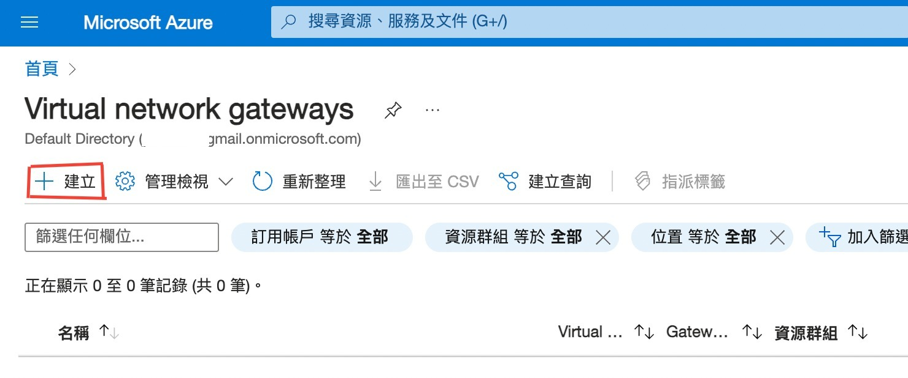

### Unit 3 - 在 Azure 中設計和實施虛擬網路匣道(Virtual Network Gateway - VNG)

## 情境模擬

現在您已經準備好在 Azure 入口網站中部署虛擬網路匣道(Virtual Network Gateway - VNG)。

連接 Lagelab 科技公司的核心服務 VNET 與 製造商 LageMan 的 VNET。

## 架構圖


### Lagelab 公司的網路佈局

- **CoreServicesVNet 美國東部：** 10.20.0.0/16
- **ManufacturingVNet 北歐：** 10.30.0.0/16

### 您將建立以下資源：

| 虛擬網路       | 區域         | 虛擬網路地址空間 | 子網路                  | 子網路地址範圍 |
|----------------|----------------|-------------------------------|-------------------------|----------------------|
| CoreServicesVnet      | 美國東部        | 10.20.0.0/16                  | GatewaySubnet           | 10.20.0.0/27         |
|                       |                |                               | DatabaseSubnet          | 10.20.20.0/24        |
| ManufacturingVnet     | 北歐    | 10.30.0.0/16                  | GatewaySubnet | 10.30.0.0/27        |
|                       |                |                               | ManufacturingSystemSubnet   | 10.30.10.0/24   |


### 在此練習中，您將：

1. **任務 1：** 建立 CoreServicesVnet 與 ManufacturingVnet 虛擬網路
2. **任務 2：** 建立 CoreServicesVM 虛擬機
3. **任務 3：** 建立 ManufacturingVM 虛擬機
4. **任務 4：** 使用 RDP 連線到虛擬機
5. **任務 5：** 測試虛擬機之間的連線
6. **任務 6：** 建立 CoreServicesVnet Gateway
7. **任務 7：** 建立 ManufacturingVnet Gateway
8. **任務 8：** 從 CoreServicesVnet 連線到 ManufacturingVnet
9. **任務 9：** 從 ManufacturingVnet 連線到 CoreServicesVnet
10. **任務 10：** 驗證連線是成功的
11. **任務 11：** 測試虛擬機之間的連線

### 預估時間 70 分鐘 (包含 ~45 分鐘等待佈建)

### 任務 1：建立 CoreServicesVnet 與 ManufacturingVnet 虛擬網路

1. 前往 [Azure 入口網站] 點選 Cloud Shell 按鈕(在畫面右上)，如果需要設定 Shell。
- * 選擇 PowerShell
- * 選擇 不需要任何儲存體帳戶 與你的訂用帳戶名稱，點套用。

- * 等待終端機建立，出現提示字元。


2. 上傳 azuredeploy.json 和 azuredeploy.parameters.json，檔案下面連結取得。
- * 檔案路徑 Allfiles\Exercises\M02

>**提示**: 
   + 檔案下載網址: https://github.com/MicrosoftLearning/AZ-700-Designing-and-Implementing-Microsoft-Azure-Networking-Solutions/archive/master.zip

3. 使用下面的 ARM (Azure Resource Manager) 範本，為這個練習建立虛擬網路與子網路。

```powershell
$RGName = "LagelabResourceGroup"
#如果資源群組不存在，會建立它。
New-AzResourceGroup -Name $RGName -Location "eastus"
New-AzResourceGroupDeployment -ResourceGroupName $RGName -TemplateFile azuredeploy.json -TemplateParameterFile azuredeploy.parameters.json
```

指令跑完會告訴你建立了三個 VNET，分別是 ResearchVnet, CoreServicesVnet 和 ManufacturingVnet。
若不想建立 ResearchVnet 可修改上傳 json 檔內容。


### 任務 2: 建立 CoreServicesVM 虛擬機

1. 與任務 1 步驟相同，上傳 CoreServicesVMazuredeploy.json 和 CoreServicesVMazuredeploy.parameters.json 範本。
使用下面的 ARM (Azure Resource Manager) 範本，為這個練習建立虛擬機。

```powershell
$RGName = "LagelabResourceGroup"
New-AzResourceGroupDeployment -ResourceGroupName $RGName -TemplateFile CoreServicesVMazuredeploy.json -TemplateParameterFile CoreServicesVMazuredeploy.parameters.json
```

>**說明**:
+ 上傳前需修改**CoreServicesVMazuredeploy.json**和**CoreServicesVMazuredeploy.parameters.json**內vmsize value為 **Standard_D2ls_v5**

+ 虛擬機價格查詢網址: https://azure.microsoft.com/zh-tw/pricing/details/virtual-machines/windows/#pricing

第一次執行出現紅字錯誤訊息，範本檔案沒有上傳。上傳後執行，會要求輸入admin密碼。


結果裡可以看到 admin 的使用者名稱是 TestUser


2. 當佈建完成，到 Azure Portal 首頁，選擇虛擬機，驗證虛擬機已被建立。

點首頁的虛擬機可以看到虛擬機 CoreServicesVM。


點虛擬機，點連線-->連線，可以看到連線 IP，與系統管理員使用者名稱。


### 任務 3: 建立 ManufacturingVM 虛擬機

1. 與任務 1 步驟相同，上傳 ManufacturingVMazuredeploy.json 和 ManufacturingVMazuredeploy.parameters.json 範本。
使用下面的 ARM (Azure Resource Manager) 範本，為這個練習建立虛擬機。
```powershell
$RGName = "LagelabResourceGroup"
New-AzResourceGroupDeployment -ResourceGroupName $RGName -TemplateFile ManufacturingVMazuredeploy.json -TemplateParameterFile ManufacturingVMazuredeploy.parameters.json
```

2. 當佈建完成，到 Azure Portal 首頁，選擇虛擬機，驗證虛擬機已被建立。

>**說明**:
+ 上傳前需修改**若使用 Powershell 建立有問題，可使用一般介面建立虛擬機**

### 任務 4: 使用 RDP 連線到虛擬機

1.在 Azure 入口網站首頁上，選擇 **「虛擬機器」**。

2.選擇 **CoreServicesVM**。


3.在 CoreServicesVM 上，選擇 **「連線」>「RDP」**。

4.關於 CoreServicesVM |連接，選擇 **下載 RDP 檔案**。


5.將 RDP 檔案儲存到您的桌面。

6.使用 RDP 檔案以及部署期間提供的使用者名稱TestUser和密碼連線到 CoreServicesVM。

   >**注意**: 密碼為先前建立VM時設定之密碼。

7.在 Azure 入口網站首頁上，選擇 **「虛擬機器」**。

8.選擇 **ManufacturingVM**。

9.在 ManufacturingVM 上，選擇 **「連線」>「RDP」**。

10.在 ManufacturingVM 上|連接，選擇 **下載 RDP 檔案**。


11.將 RDP 檔案儲存到您的桌面。

12.使用 RDP 檔案以及您在部署期間提供的使用者名稱TestUser和密碼連線到 ManufacturingVM。

   >**注意**: 密碼為先前建立VM時設定之密碼。

13.在兩台虛擬機器上的「選擇裝置的隱私設定」中，選擇「接受」。

14.在兩台虛擬機器上的「網路」中，選擇「是」。

15.分別在ManufacturingVM、CoreServicesVM 上，開啟 PowerShell 提示字元並執行下列命令：ipconfig


16.記下 IPv4 位址。


### 任務 5: 測試虛擬機之間的連線

1.在 ManufacturingVM 上，開啟 PowerShell 提示字元。

2.使用下列命令驗證沒有與 CoreServicesVnet 上的 CoreServicesVM 的連線。確保使用 CoreServicesVM 的 IPv4 位址。

   ```powershell
    Test-NetConnection 10.20.20.4 -port 3389
   ```

3.測試連線應該會失敗，您將看到類似以下內容的結果：


### 任務 6：** 建立 CoreServicesVnet Gateway**
1. 在上方的**搜尋資源、服務及文件 (G+/)**, 輸入 **Virtual network gateway**, 在結果中選擇**Virtual network gateways**。


2. 在 Virtual network gateways, 點 ** + 建立 **。



3. 使用下表中資訊，建立 Virtual network gateway。

| 標籤            | 段落               | 選項                  | 值                  |
|----------------|----------------------|------------------------|------------------------|
| 基本         |專案詳細資料                |訂用帳戶  |無需更改 |
|       |      | 資源群組       | LagelabResourceGroup   |
|       |執行個體詳細資料    |名稱       | CoreServicesVnetGateway  |
|       |                | 區域               | (美國) 美國東部  East US       |
|       |                | SKU               | VpnGw1 |
|       |                | 世代               | Generation1 |
|       |                | 虛擬網路            | CoreServicesVnet |
|       |                | 子網路             | GatewaySubnet (10.20.0.0/27) |
|       |                | 公用 IP 位址 SKU    | 標準 |
|       |公用 IP 位址      | 公用 IP 位址      | 建立新的 |
|       |                | 公用 IP 位址 名稱    | CoreServicesVnetGateway-ip |
|       |                | 啟用主動 - 主動模式   | 己停用 |
|       |                | 設定 BGP            | 己停用 |
| 檢閱 + 建立  |    | 檢閱您的設定並選擇 **建立** | |


>**說明**: 建立虛擬網路閘道需要15到30分鐘。您不需要等待佈建完成。繼續建立下一個閘道。

**任務 7：** 建立 ManufacturingVnet Gateway

建立閘道子網路

>**說明**: 本實驗已於任務 1 中，建立 CoreServicesVnet 的閘道子網路，在此手動建立閘道子網路。

1. 在上方的**搜尋資源、服務及文件 (G+/)**, 輸入 **ManufacturingVnet**, 點選 ManufacturingVnet 虛擬網路。

2. 於左方點**設定**, 點**子網路**, 點**+ 子網路**。

3. 點**新增**。


| 參數            | 值                  |
|----------------|------------------------|
| 子網路用途       | **Virtual network gateway**       |
| 大小            | **/27 (32 個位址)**               |


建立虛擬網路閘道

與任務 6 相同，使用下表中資訊，建立 ManufacturingVnet 的 Virtual network gateway。

| 標籤            | 段落               | 選項                  | 值                  |
|----------------|----------------------|------------------------|------------------------|
| 基本         |專案詳細資料                |訂用帳戶  |無需更改 |
|       |      | 資源群組       | LagelabResourceGroup   |
|       |執行個體詳細資料    |名稱       | ManufacturingVnetGateway  |
|       |                | 區域               | North Europe       |
|       |                | SKU               | VpnGw1 |
|       |                | 世代               | Generation1 |
|       |                | 虛擬網路            | ManufacturingVnet |
|       |                | 子網路             | GatewaySubnet (10.30.0.0/27) |
|       |                | 公用 IP 位址 SKU    | 標準 |
|       |公用 IP 位址      | 公用 IP 位址      | 建立新的 |
|       |                | 公用 IP 位址 名稱    | ManufacturingVnetGateway-ip |
|       |                | 啟用主動 - 主動模式   | 己停用 |
|       |                | 設定 BGP            | 己停用 |
| 檢閱 + 建立  |    | 檢閱您的設定並選擇 **建立** | |

>**說明**: 建立虛擬網路閘道需要15到30分鐘。


**任務 8：** 從 CoreServicesVnet 連線到 ManufacturingVnet

1. 在上方的**搜尋資源、服務及文件 (G+/)**, 輸入 **Virtual network gateway**, 在結果中選擇**Virtual network gateways**。

2. 在 Virtual network gateways, 點先前任務建立的 ** CoreServicesVnetGateway **。


3. 在 CoreServicesVnetGateway ，先選連接，再選**新增**


>**注意**: 虛擬網路閘道完全建立完成，才能完成連接設定。

4. 使用下面表格資訊與設定分頁來建立虛擬網路閘道。

| 選項                  | 值                  |
|----------------|----------------------|
|名稱|CoreServicesGW-to-ManufacturingGW|
|連接類型|Vnet對Vnet|
|區域|East US|
|第一個虛擬網路閘道|CoreServicesVnetGateway|
|第二個虛擬網路閘道|ManufacturingVnetGateway|
|共用金鑰(PSK)| abc123 |
|使用 Azure 私人 IP 地址|不選|
|啟用 BGP|不選|
|IKE 通訊協定|IKEv2|
|訂用帳戶|不變|
|資源群組|不變|


5. 點**檢閱 + 建立**檢查設定後，按建立。


**任務 9：** 從 ManufacturingVnet 連線到 CoreServicesVnet

1. 在上方的**搜尋資源、服務及文件 (G+/)**, 輸入 **Virtual network gateway**, 在結果中選擇**Virtual network gateways**。

2. 在 Virtual network gateways, 點先前任務建立的 ** ManufacturingVnetGateway **。

3. 在 ManufacturingServicesVnetGateway ，先選連接，再選**新增**

>**注意**: 虛擬網路閘道完全建立完成，才能完成連接設定。

4. 使用下面表格資訊與設定分頁來建立虛擬網路閘道。

| 選項                  | 值                  |
|----------------|----------------------|
|名稱|ManufacturingGW-to-CoreServicesGW|
|連接類型|Vnet對Vnet|
|區域|North Europe|
|第一個虛擬網路閘道|ManufacturingVnetGateway|
|第二個虛擬網路閘道|CoreServicesVnetGateway|
|共用金鑰(PSK)| abc123 |
|使用 Azure 私人 IP 地址|不選|
|啟用 BGP|不選|
|IKE 通訊協定|IKEv2|
|訂用帳戶|不變|
|資源群組|不變|


5. 點**檢閱 + 建立**檢查設定後，按建立。 

**任務 10：** 驗證連線是成功的

1. 在上方的**搜尋資源、服務及文件 (G+/)**, 輸入 **vpn**, 從結果中選擇 connections。

2. 等待兩個 connections Status 都變成 connected


**任務 11：** 測試虛擬機之間的連線

1. 因為我的 ManufacturingVM 連不上，所以我從 CoreServicesVM 打開 Powershell。

2. 使用下面指令驗證有一個新的連線到 ManufacturingVnet 上的 ManufacturingVM。確認下面的 IP 是 ManufacturingVM 的 IP。

   ```powershell
    Test-NetConnection 10.20.20.4 -port 3389
   ```

3. 測試連線應該會成功，您將看到類似以下內容的結果：


4. 關閉遠端連線。

