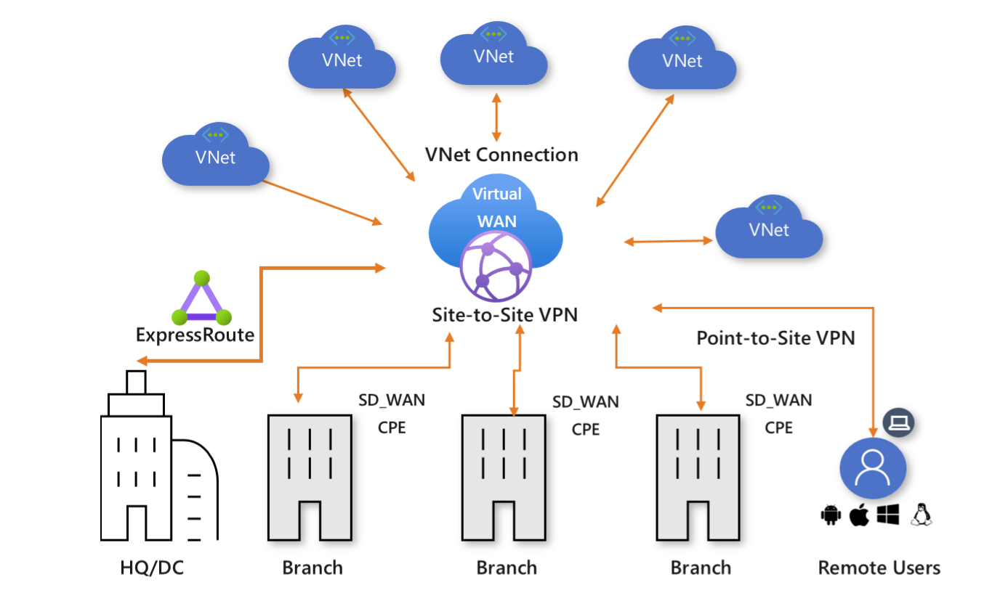
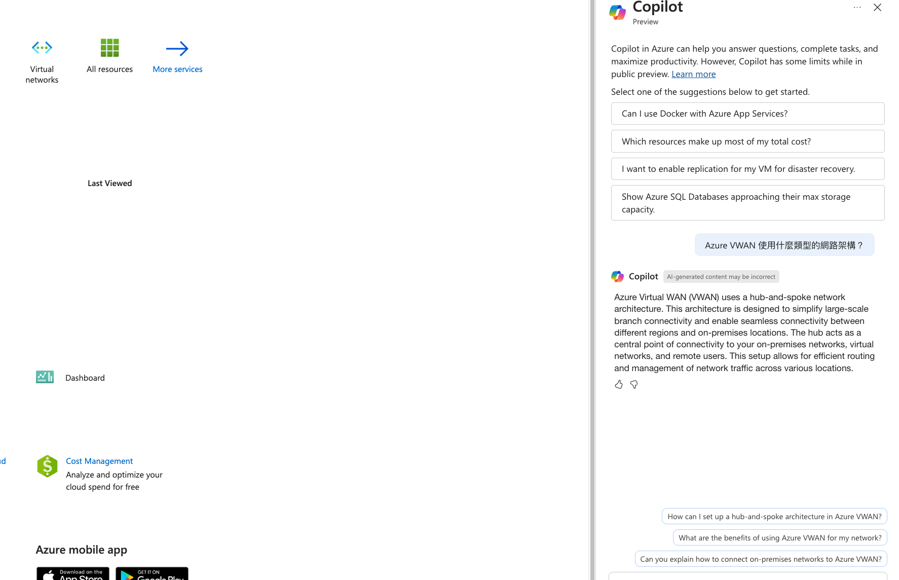

### 小試身手 M02-單元 7 - 使用 Azure 入口網站建立虛擬 WAN

> **辣個通知** 請先確保您有看過這個影片註冊 Azure Free Account - https://youtu.be/ZsfllNRuErk?si=3q2RHUsL9vrX3ltB

## 情境模擬

在本練習中，您將為 Lagelab 建立一個虛擬 WAN。

## 架構圖
---


實際上 VWAN 應用場景架構圖




在本練習中，您將:

+ 任務 1: 建立虛擬 WAN
+ 任務 2: 使用 Azure 入口網站建立中樞
+ 任務 3: 將 VNet 連接到虛擬中樞

>**注意**: 提供了一個**[互動式實驗室模擬](https://mslabs.cloudguides.com/guides/AZ-700%20Lab%20Simulation%20-%20Create%20a%20virtual%20WAN%20using%20the%20Azure%20portal)**，允許您按照自己的節奏點擊完成此實驗室。互動式模擬與託管實驗室之間可能會有細微差異，但所展示的核心概念和想法是相同的。

### 預計時間: 65 分鐘（包括約 45 分鐘的部署等待時間）

## 任務 1: 建立虛擬 WAN

1. 從瀏覽器導航到 Azure 入口網站並使用您的 Azure 帳戶登入。

1. 在入口網站中，在搜尋框中輸入 Virtual WAN，然後從結果列表中選擇 **Virtual WANs**。

   

1. 在虛擬 WAN 頁面上，選擇 + **建立**。

1. 在建立 WAN 頁面的 **基本** 選項卡中，填寫以下字段:

   + **訂閱:** 使用現有的訂閱

   + **資源組:** ContosoResourceGroup

   + **資源組位置:** 從下拉列表中選擇一個資源位置。WAN 是一個全球資源，不存在於特定區域。但是，您必須選擇一個區域來管理和放置您建立的 WAN 資源。

   + **名稱:** ContosoVirtualWAN

   + **類型:** 標準

1. 完成填寫字段後，選擇 **檢閱 + 建立**。

1. 一旦驗證通過，選擇 **建立** 來建立虛擬 WAN。

## 任務 2: 使用 Azure 入口網站建立中樞

中樞包含用於站點到站點、ExpressRoute 或點到站點功能的閘道。在虛擬中樞中建立站點到站點 VPN 閘道需要 30 分鐘。您必須先建立虛擬 WAN，然後才能建立中樞。

1. 找到您建立的虛擬 WAN。
   
1. 在虛擬 WAN 頁面上，在 **連接** 下，選擇 **中樞**。

1. 在中樞頁面上，選擇 **+新中樞** 打開建立虛擬中樞頁面。
   


1. 在建立虛擬中樞頁面的 **基本** 選項卡上，完成以下字段:
   + **區域:** 美國西部
   + **名稱:** ContosoVirtualWANHub-WestUS
   + **中樞私有地址空間:** 10.60.0.0/24
   + **虛擬中樞容量:** 2 個路由基礎設施單位
   + **中樞路由偏好:** 保留默認設置

1. 選擇 **下一步: 站點到站點**。

1. 在 **站點到站點** 選項卡上，完成以下字段:
   + **是否要建立站點到站點 (VPN 閘道)?:** 是
   + **AS 號碼** 字段無法編輯。
   + **閘道規模單位:** 1 個規模單位 = 500 Mbps x 2
   + **路由偏好:** 保留默認設置

1. 選擇 **檢閱 + 建立** 進行驗證。

1. 選擇 **建立** 以建立中樞。

1. 30 分鐘後，**刷新** 以在中樞頁面上查看中樞。

## 任務 3: 將 VNet 連接到虛擬中樞

1. 找到您建立的虛擬 WAN。

1. 在 ContosoVirtualWAN 中，在 **連接** 下，選擇 **虛擬網路連接**。

   

1. 在 ContosoVirtualWAN | 虛擬網路連接中，選擇 **+ 添加連接**。

1. 在添加連接中，使用以下信息建立連接。

   + **連接名稱:** ContosoVirtualWAN-to-ResearchVNet

   + **中樞:** ContosoVirtualWANHub-WestUS

   + **訂閱:** 無變更

   + **資源組:** ContosoResourceGroup

   + **虛擬網路:** ResearchVNet

   + **傳播到無:** 是

   + **關聯路由表:** 默認

1. 選擇 **建立**。

## 清理資源

   >**注意**: 請記得移除您不再使用的所有新建 Azure 資源。移除未使用的資源可確保您不會看到意外的費用。

1. 在 Azure 入口網站上，在 **Cloud Shell** 窗格中打開 **PowerShell** 會話。

1. 通過運行以下命令刪除您在本模組的實驗室中建立的所有資源組:

   ```powershell
   Remove-AzResourceGroup -Name 'ContosoResourceGroup' -Force -AsJob
   ```

   >**注意**: 該命令異步執行（由 -AsJob 參數決定），因此，雖然您可以在同一 PowerShell 會話中立即運行另一個 PowerShell 命令，但實際上需要幾分鐘時間才能真正刪除資源組。

## 使用 Copilot 牛刀小試

Copilot 可以幫助您學習如何使用 Azure 腳本工具。Copilot 還可以在實驗室未涵蓋的區域或您需要更多信息的地方提供協助。打開 Edge 瀏覽器並選擇 Copilot（右上角）或導航至 *copilot.microsoft.com*。花幾分鐘嘗試這些提示。
* Azure VWAN 使用什麼類型的網路架構？
* Azure VWAN 基本版和標準版有什麼區別？提供示例。
* 是否可以使用腳本工具創建 Azure VWAN？



## 關鍵要點

以下是使用 Azure Virtual WAN 的三大好處：

1. **全球可擴展性和最佳化連接**  
   Azure Virtual WAN 提供全球可擴展的網路架構，能夠輕鬆連接多個地理位置的網路點。其採用的中心辐射式架構（hub-and-spoke）確保了網路流量的最佳化，減少延遲並提高整體網路性能.

2. **簡化網路配置和安全性**  
   Azure Virtual WAN 集中管理網路配置和安全性，讓企業能夠簡化複雜的網路設定。它與 Azure Firewall 和其他安全功能整合，提供一致的安全政策執行和流量控制，保護企業數據。

3. **成本效益和高可用性**  
   使用 Azure Virtual WAN 可以減少傳統網路硬體的成本，並提供高可用性和可靠性。它內建備援和容錯功能，確保關鍵應用程序和服務的高可用性，從而降低停機時間並增強網路韌性。


## 技術學習補充

* [Azure 虛擬 WAN 簡介](https://learn.microsoft.com/training/modules/introduction-azure-virtual-wan/)。在本模組中，您將了解 Azure 虛擬 WAN 功能和特性。
* [設計和實施混合式網路](https://learn.microsoft.com/training/modules/design-implement-hybrid-networking/)。在本模組中，您將學習如何設計和實施 Azure 虛擬 WAN。
* [Azure VWAN 如何運作](https://learn.microsoft.com/en-us/training/modules/introduction-azure-virtual-wan/3-how-azure-virtual-wan-works) (必看！！)


