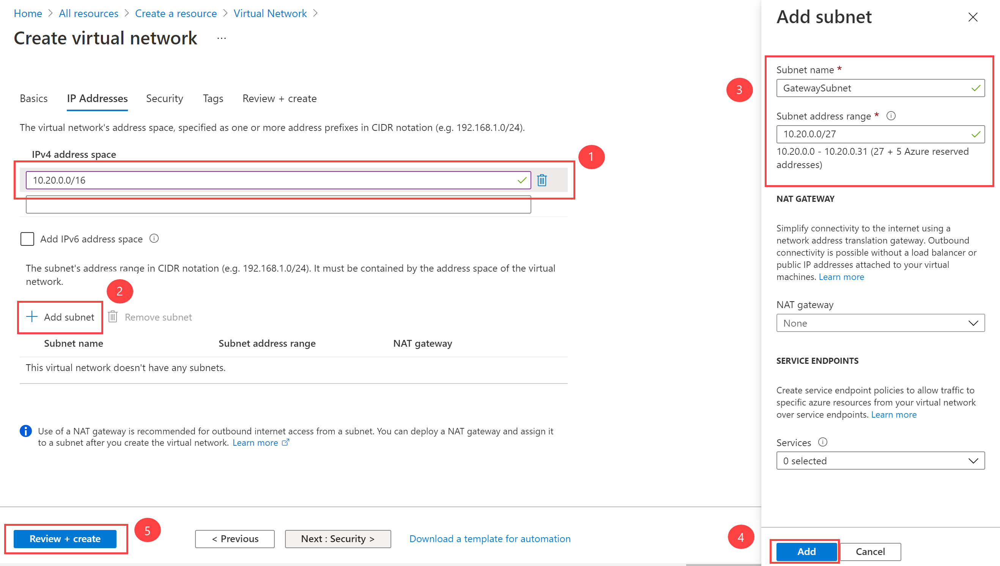

### 小試身手 M03-單元 4 設定 ExpressRoute 閘道

> **辣個通知** 請先確保您有看過這個影片註冊 Azure Free Account - https://youtu.be/ZsfllNRuErk?si=3q2RHUsL9vrX3ltB

## 情境模擬
Lagelab 想要透過 ExpressRoute 連線 Azure 虛擬網路和內部部署網路，我們必須先建立虛擬網路閘道。虛擬網路閘道有兩個用途：在網路之間交換 IP 路由，以及路由網路流量。

## 架構圖

   >**注意**：提供**[互動式實驗室模擬](https://mslabs.cloudguides.com/guides/AZ-700%20Lab%20Simulation%20-%20Configure%20an%20ExpressRoute%20gateway)**，讓您可以按照自己的步調點選完成此實驗室。您可能會發現互動式模擬與託管實驗室之間略有差異，但所展示的核心概念和想法是相同的。

### 預估時間：60 分鐘（包含約 45 分鐘的部署等待時間）

**閘道類型**

當您建立虛擬網路閘道時，您需要指定數個設定。其中一個必要的設定 'GatewayType'，指定閘道是用於 ExpressRoute 還是 VPN 流量。兩種閘道類型為：

- **VPN** - 若要透過公用網際網路傳送加密流量，您可以使用閘道類型 'VPN'。這也稱為 VPN 閘道。站對站、點對站和 VNet 對 VNet 連線都使用 VPN 閘道。
- **ExpressRoute** - 若要在私人連線上傳送網路流量，您可以使用閘道類型 'ExpressRoute'。這也稱為 ExpressRoute 閘道，是在設定 ExpressRoute 時使用的閘道類型。

每個虛擬網路每種閘道類型只能有一個虛擬網路閘道。例如，您可以有一個使用 -GatewayType VPN 的虛擬網路閘道，以及一個使用 -GatewayType ExpressRoute 的虛擬網路閘道。

在此練習中，您將：

- 工作 1：建立 VNet 和閘道子網路
- 工作 2：建立虛擬網路閘道

## 任務 1：建立 VNet 和閘道子網路

1. 在任何 Azure 入口網站頁面中，於**搜尋資源、服務和文件**中輸入 virtual network，然後從結果中選取**虛擬網路**。

1. 在虛擬網路頁面上，選取 **+建立**。

1. 在建立虛擬網路窗格的**基本**索引標籤上，使用下表中的資訊建立 VNet：

   | **設定**          | **值**                        |
   | -------------------- | -------------------------------- |
   | 虛擬網路名稱 | CoreServicesVNet                 |
   | 資源群組       | ContosoResourceGroup             |
   | 位置             | 美國東部                          |

1. 選取**下一步：IP 位址**。

1. 在 **IP 位址**索引標籤的 **IPv4 位址空間**中，輸入 10.20.0.0/16，然後選取 **+ 新增子網路**。

1. 在新增子網路窗格中，使用下表中的資訊建立子網路：

   | **設定**                  | **值**               |
   | ---------------------------- | ----------------------- |
   | 子網路用途               | 虛擬網路閘道 |
   | 閘道子網路位址空間 | 10.20.0.0/27            |

請注意，子網路名稱將會自動填入。

1. 然後選取**新增**。

1. 在建立虛擬網路頁面上，選取**檢閱 + 建立**。

   

2. 確認 VNet 通過驗證，然後選取**建立**。

   >**注意**：如果您使用雙堆疊虛擬網路，並計劃透過 ExpressRoute 使用 IPv6 型私人對等互連，請選取新增 IP6 位址空間並輸入 IPv6 位址範圍值。

## 工作 2：建立虛擬網路閘道

1. 在任何 Azure 入口網站頁面中，於**搜尋資源、服務和文件 (G+/)** 中輸入 virtual network gateway，然後從結果中選取**虛擬網路閘道**。

1. 在虛擬網路閘道頁面上，選取 **+建立**。

1. 在**建立虛擬網路閘道**頁面上，使用下表中的資訊建立閘道：

   | **設定**               | **值**                  |
   | ------------------------- | -------------------------- |
   | **專案詳細資料**       |                            |
   | 資源群組            | ContosoResourceGroup       |
   | **執行個體詳細資料**      |                            |
   | 名稱                      | CoreServicesVnetGateway    |
   | 區域                    | 美國東部                   |
   | 閘道類型              | ExpressRoute               |
   | SKU                       | 標準                   |
   | 虛擬網路           | CoreServicesVNet           |
   | **公用 IP 位址**     |                            |
   | 公用 IP 位址         | 建立新的                 |
   | 公用 IP 位址名稱    | CoreServicesVnetGateway-IP |
   | 指派                | 不可設定           |

1. 選取**檢閱 + 建立**。

1. 確認閘道設定通過驗證，然後選取**建立**。

1. 部署完成後，選取**前往資源**。

   >**注意**：部署閘道最多可能需要 45 分鐘。

## 使用 Copilot 牛刀小試

Copilot 可以協助您學習如何使用 Azure 指令碼工具。Copilot 也可以在實驗室未涵蓋或您需要更多資訊的領域提供協助。開啟 Edge 瀏覽器並選擇 Copilot（右上角）或瀏覽至 *copilot.microsoft.com*。花幾分鐘嘗試這些提示。
+ Azure ExpressRoute 與虛擬 WAN 有何不同？您可以一起使用這些技術嗎？提供範例。
+ 在選擇 ExpressRoute 提供者模型和 ExpressRoute Direct 之間，我應該考慮什麼？
+ 建立一個表格，摘要說明 Azure ExpressRoute SKU 及其功能。

## 透過自學訓練了解更多

+ [Azure ExpressRoute 簡介](https://learn.microsoft.com/training/modules/intro-to-azure-expressroute/)。在此模組中，您將了解 Azure ExpressRoute 是什麼以及它提供的功能。
+ [設計和實作 ExpressRoute](https://learn.microsoft.com/training/modules/design-implement-azure-expressroute/)。在此模組中，您將學習如何設計和實作 Azure ExpressRoute、ExpressRoute Global Reach、ExpressRoute FastPath。

## 關鍵要點

1. **Azure ExpressRoute 的功能與用途**
Azure ExpressRoute 提供專用的高頻寬連線，允許企業將內部部署網路直接連接到 Microsoft Azure 和 Microsoft 365 雲端服務。這種私密連線避免了使用公共網路，提升了安全性和可靠性。
2. **高可用性與安全性**
Microsoft 保證 ExpressRoute 的最低可用性為 99.95%。由於流量透過專用線路傳輸，第三方無法攔截流量，確保數據傳輸的安全性。
3. **連線方式**
用戶可以透過以下四種方式建立內部部署網路與 Microsoft 雲端之間的連線：
    - CloudExchange 主機代管
    - 點對點乙太網路連線
    - 任意對任意 (IPVPN) 連線
    - ExpressRoute Direct
4. **ExpressRoute 的功能 SKU**
ExpressRoute 提供三種功能級別（SKU）：本地、標準和進階。每種級別適用於不同的需求，例如本地化操作、區域內連線或全球連線。
5. **主要優勢**
    - **低延遲與高頻寬**：提供穩定的低延遲和高頻寬，適合需要快速響應的應用程式。
    - **增強的安全性與合規性**：避免公共網路風險，滿足嚴格的數據隱私和合規要求。
    - **內建冗餘**：每個 ExpressRoute 電路都包含雙重連線，確保高可靠性。
6. **適用場景**
    - 混合雲部署：將內部部署環境擴展至 Azure，實現混合雲架構。
    - 大規模數據遷移：快速、安全地遷移大量數據。
    - 災難恢復與業務持續性：利用專用連線進行高效備份與複製。

## 技術學習補充

[關鍵技術要點以及 SKU 說明](https://www.perplexity.ai/search/gai-yi-gai-xue-xi-azure-expres-ZkETXZKJRZqmy0q3.ZPRSw#1)