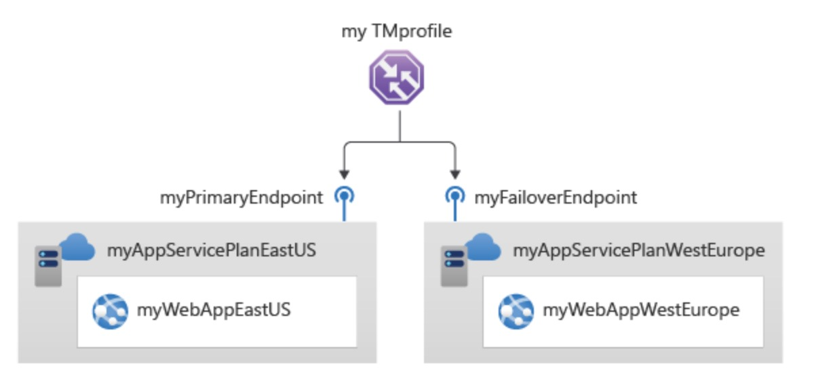
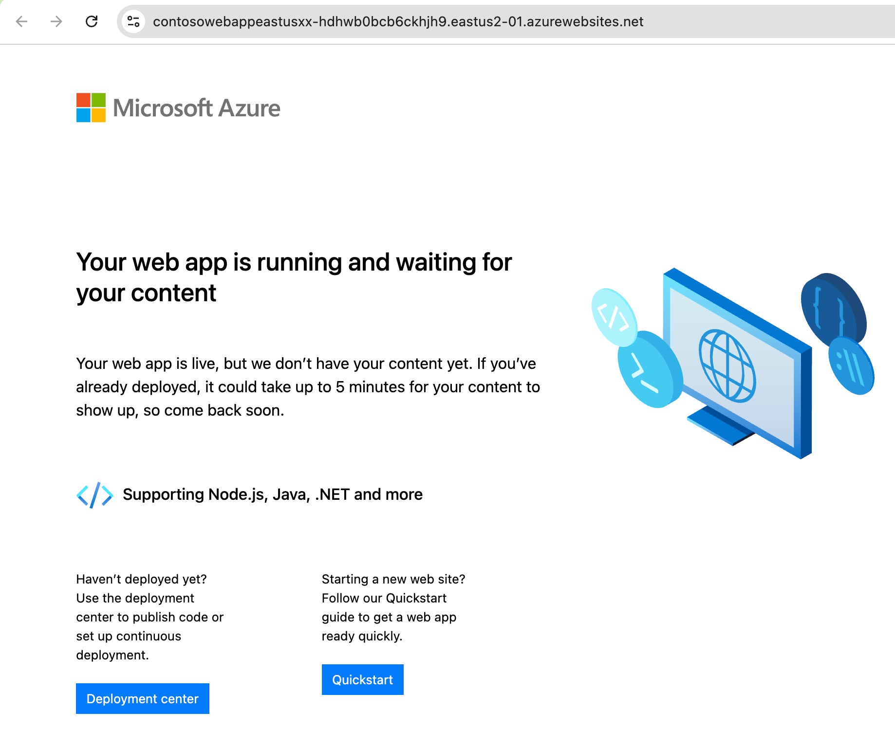
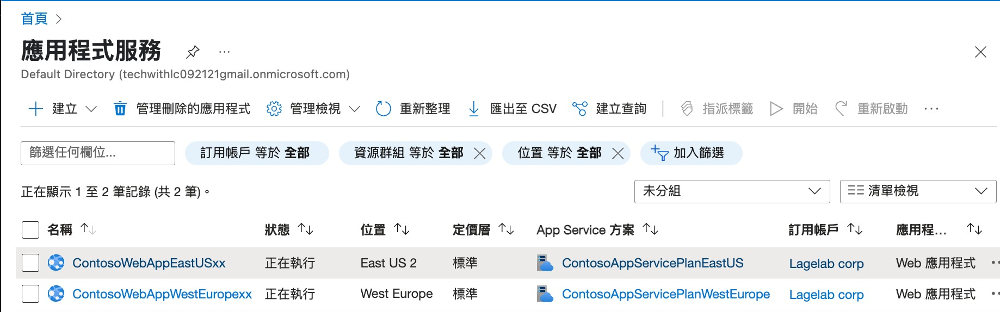
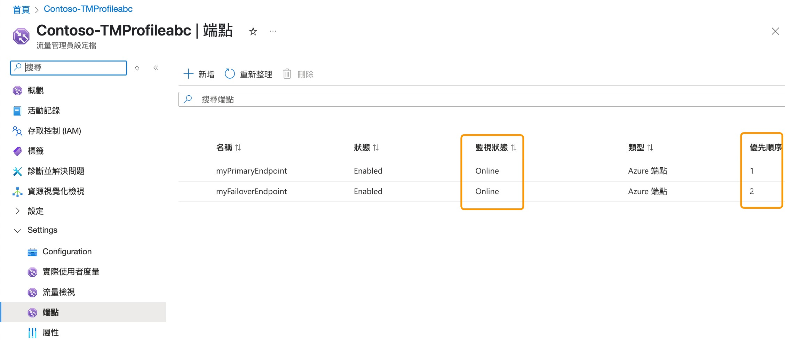
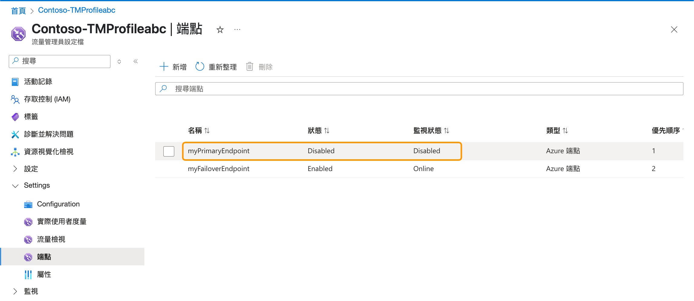
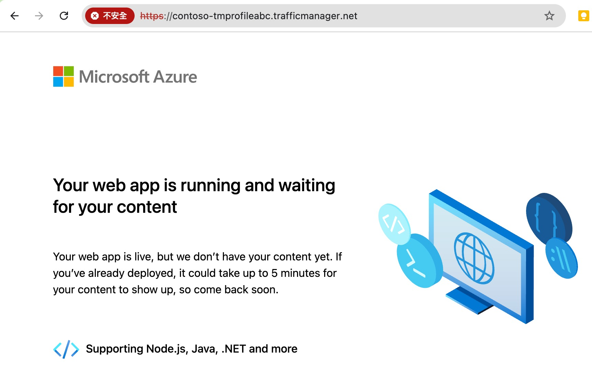

### M04Unit 6 - 在 Azure 中建立流量管理員設定檔(Traffic Management Profiles)

## 情境模擬

建立流量管理員設定檔(Traffic Management Profiles)，提供高可用性的網頁應用程式。

連接 Lagelab 科技公司的核心服務 VNET 與 製造商 LageMan 的 VNET。

## 架構圖



### Lagelab 公司的網頁應用程式區域

- **ContosoWebAppEastUSxx 美東：**
- **ContosoWebAppWestEuropexx 西歐：**

### 您將建立以下資源：

| 資源群組       | 區域         | 資源 | 名稱                  |
|----------------|----------------|-------------------------------|-------------------------|
| Contoso-RG-TM1      | 美東        | Web 應用程式                  | ContosoWebAppEastUSxx           |
|                       |      美東       |     流量管理員設定檔  | Contoso-TMProfilexx          |
| Contoso-RG-TM2     | 西歐    | Web 應用程式                  | ContosoWebAppWestEuropexx |
|                       |                |                               |    |

### 在此練習中，您將：

1. **任務 1：** 建立 Web 應用程式
2. **任務 2：** 建立 流量管理員設定檔
3. **任務 3：** 新增 流量管理員端點
4. **任務 4：** 測試 流量管理員設定檔

### 預估時間 35 分鐘

### 補充說明 流量管理員設定檔 與 負戴平衡器 (Server Load Balancer) 的比較

| 特性       |  流量管理員設定檔        | 負戴平衡器 | 
|----------------|----------------|-------------------------------|
| 核心功能 | DNS 層級的流量導流 (Global Traffic Routing) | 傳輸層 (Layer 4) 或應用程式層 (Layer 7) 的負載平衡 (Local Load Balancing) |
| 作用範圍 | 全球 (Global) | 區域 (Regional) |
| 負載平衡機制 | 基於 DNS 的路由策略 (例如：效能、地理位置、加權、優先順序、子網路) | 基於健康檢查和分發演算法 (例如：五元組雜湊、會話持續性) |
| 使用案例 | 多區域服務部署： 將不同地區的使用者導向最近的資料中心，提升效能。災難復原： 在主要區域故障時，將流量無縫切換到備援區域。藍綠部署/A/B 測試： 逐步將流量導向新版本或不同版本。 | 應用程式負載平衡： 在同一區域內的多個伺服器之間分配應用程式流量，提高應用程式的可用性和回應能力。內部負載平衡： 在虛擬網路內部平衡流量，例如在應用程式層和資料庫層之間。前端負載平衡： 將來自網際網路的流量分發到後端伺服器。 |


### 任務 1：建立 Web 應用程式

1. 前往 [Azure 入口網站] ，點選搜尋資源、服務及文件 (G+/)，輸入 應用程式服務。

2. 點 **建立**，選 Web 應用程式。於基本頁面，依照下表設定 。

| Setting | Value |
|---------|--------|
| 訂用帳戶 | 選你的訂用帳戶 |
| 資源群組 | 選新建，名稱 Contoso-RG-TM1 |
| 名稱 | ContosoWebAppEastUSxx (xx 使用你的姓名縮寫讓名稱獨一無二) |
| 發佈 | 代碼 |
| 執行階段堆疊 | ASP.NET V4.8 |
| 作業系統 | Windows |
| 地區 | East US |
| Windows 方案 Canada Central)| 建立新項目，名稱 ContosoAppServicePlanEastUS |
| 定價方案 | Standard S1 100 total ACU, 1.75-GB memory |

3. 點 **監視器+安全** 頁面，選 **否**，啟用 Application Insights。

4. 點 **檢閱+建立**

5. 點 **建立**，當 Web 應用程式成功佈建，會建立一個預設網站。



6. 重複 **步驟1~5**，建立第二個 Web 應用程式。

| Setting | Value |
|---------|--------|
| 資源群組 | 選新建，名稱 Contoso-RG-TM2 |
| 名稱 | ContosoWebAppWestEuropexx (xx 使用你的姓名縮寫讓名稱獨一無二) |
| 地區 | West Europe |
| Windows 方案 (Canada Central) | 建立新項目，名稱 ContosoAppServicePlanWestEurope |





### 任務 2: 建立 流量管理員設定檔

1. 前往 [Azure 入口網站] ，點選搜尋資源、服務及文件 (G+/)，輸入 流量管理。

2. 點 建立。

3. 使用下表建立流量管理員設定檔

| Setting | Value |
|---------|--------|
| 名稱 | Contoso-TMProfilexx (xx 使用你的姓名縮寫讓名稱獨一無二)|
| Routing method | 優先順序 |
| 訂用帳戶 | 你的帳戶 |
| 資源群組 | Contoso-RG-TM1 |
| Resource group location | East US |

4. 點 建立。

### 任務 3: 新增 流量管理員端點

1. 在 Azure 入口網站首頁上，點 所有資源。在資源列表內 點選 Contoso-TMProfilexx

2. 在 settings 下選擇端點。

3. 點選新增，依照下表資訊新增端點。

| Setting | Value |
|---------|--------|
| 類型 | Azure 端點 |
| 名稱 | myPrimaryEndpoint |
| 目標資源類型 | App Service |
| 目標資源 | ContosoWebAppEastUSxx (East US) |
| 優先順序 | 1 |

4. 選新增。

5. 重復步驟 2~4 建立 failover 端點。使用相同設定，除下表之資訊。

| Setting | Value |
|---------|--------|
| 名稱 | myFailoverEndpoint |
| 目標資源 | ContosoWebAppWestEuropexx (West Europe) |
| 優先順序 | 2 |

6. 優先順序 2 指當設定的主要端點不建康時，流量會轉送到 failover 端點。

7. 在 settings 下，選擇 Configuration，更新端點監視設定的通訊協定為 HTTPS, 連接埠為 443，然後儲存。

8. 在流量管理員設定檔裡會看到兩個新的端點。需要注意的是，在數分鐘後監視狀態應該變成 Online。




### 任務 4: 測試 流量管理員設定檔

1. 在 Contoso-TMProfile 頁面，選擇 ** 概觀。 **

2. 在 概觀 頁面，複製 DNS 名稱(或保存在某處)。

3. 打開一個瀏覽器分頁貼上 DNS 名稱到網址列，按下 Enter。

4. 預設的網頁應用程式應該會顯示出來。如果你看到 404 網址沒有找到的訊息，從 Contoso-TMProfilexx 流量管理員的概觀頁面，先 Disable profile 再 Enable profile。然後重新整理網頁。

5. 因為網頁沒有使用安全憑證，所以你會看到 chrome 警告你「你的連線不是私人連線」。

6. 此時點進階後，點下方的 繼續前往 (你的DNS名稱) 網站(不安全)。即可看到畫面。

7. 目前所有的流量都被送到設定優先順序設定為 1 的 主要端點。

8. 為了測試 failover 端點正常運作，你需要停用主網站端點。

9. 在 Contoso-TMProfileabc 頁面上的 Setting 下的端點，選擇 myPrimaryEndpoint 最右邊的筆編輯。

10. 在 myPrimaryEndpoint 頁面，取消勾選啟用端點，接著按儲存。

11. 關閉 myPrimaryEndpoint 頁面。

12. 在 Contoso-TMProfileabc 頁面上的 Setting 下的端點，應可以看到 myPrimaryEndpoint 的監視狀態是 Disabled。



13. 打開一個新的瀏覽器分頁，貼上同樣的 DNS 名稱到網址列，按下 Enter。

14. 驗證你的 Web應用程式仍然有回應。在你的主要端點不可用的情況下，流量都會被導到 failover 端點持續提供服務。



### **清除資源**。

1. 前往 [Azure 入口網站] 打開在 Cloud Shell 裡的 PowerShell session。

2. 刪除所有此實驗的資源，使用下面的指令。

```powershell
Remove-AzResourceGroup -Name 'Contoso-RG-TM1' -Force -AsJob
Remove-AzResourceGroup -Name 'Contoso-RG-TM2' -Force -AsJob
```

