### M04Unit 6 - 在 Azure 中建立流量管理員設定檔(Traffic Management Profiles)

## 情境模擬

建立流量管理員設定檔(Traffic Management Profiles)，提供高可用性的網頁應用程式。

連接 Lagelab 科技公司的核心服務 VNET 與 製造商 LageMan 的 VNET。

## 架構圖

### Lagelab 公司的網頁應用程式區域

- **ContosoWebAppEastUSxx 美東：**
- **ContosoWebAppWestEuropexx 西歐：**

### 您將建立以下資源：

| 資源群組       | 區域         | 資源 | 名稱                  |
|----------------|----------------|-------------------------------|-------------------------|
| Contoso-RG-TM1      | 美東        | Web 應用程式                  | ContosoWebAppEastUSxx           |
|                       |      美東       |     流量管理員設定檔  | Contoso-TMProfilexx          |
| Contoso-RG-TM2     | 西歐    | Web 應用程式                  | ContosoWebAppWestEuropexx |
|                       |                |                               |    |

### 在此練習中，您將：

1. **任務 1：** 建立 Web 應用程式
2. **任務 2：** 建立 流量管理員設定檔
3. **任務 3：** 新增 流量管理員端點
4. **任務 4：** 測試 流量管理員設定檔

### 預估時間 35 分鐘

### 任務 1：建立 Web 應用程式

1. 前往 [Azure 入口網站] ，點選搜尋資源、服務及文件 (G+/)，輸入 應用程式服務。

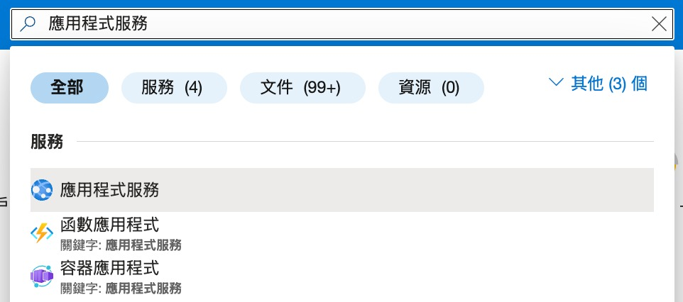

2. 點 建立，選 Web 應用程式。於基本頁面，依照下表設定 。

| Setting | Value |
| 訂用帳戶 | 選你的訂用帳戶 |
| 資源群組 | 選新建，名稱 Contoso-RG-TM1 |
| 名稱 | ContosoWebAppEastUSxx (xx 使用你的姓名縮寫讓名稱獨一無二) |
| 發佈 | 代碼 |
| 執行階段堆疊 | ASP.NET V4.8 |
| 作業系統 | Windows |
| 地區 | East US |
| Windows 方案 (Canada Central) | 建立新項目，名稱 ContosoAppServicePlanEastUS |
| 定價方案 | Standard S1 100 total ACU, 1.75-GB memory |

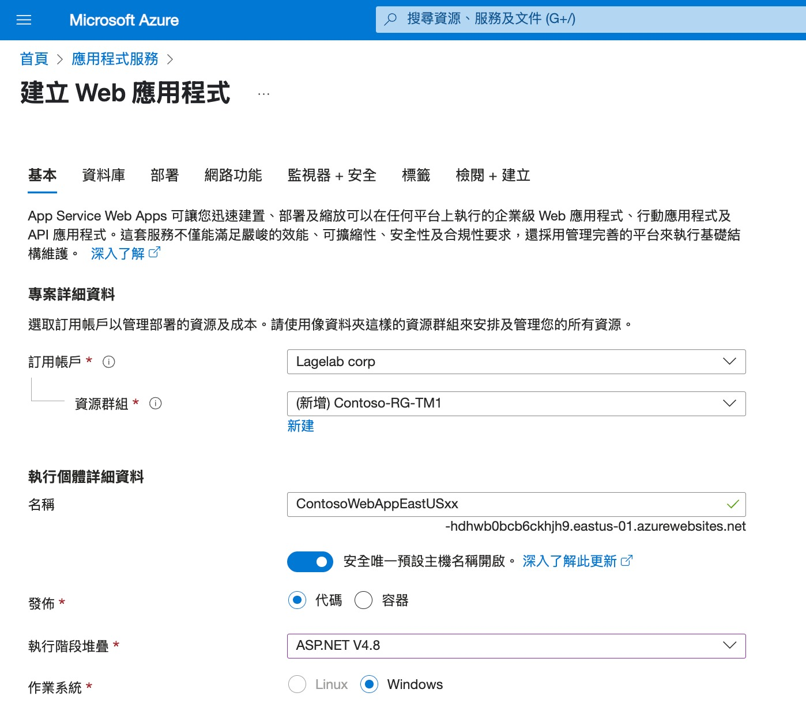

3. 點 **監視器+安全** 頁面，選 **否**，啟用 Application Insights。

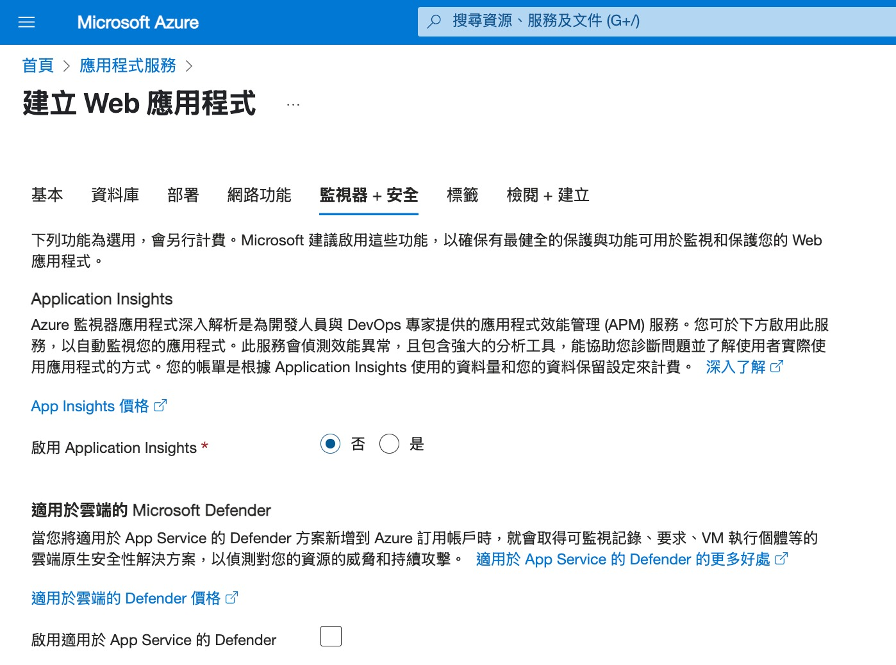

4. 點 **檢閱+建立**

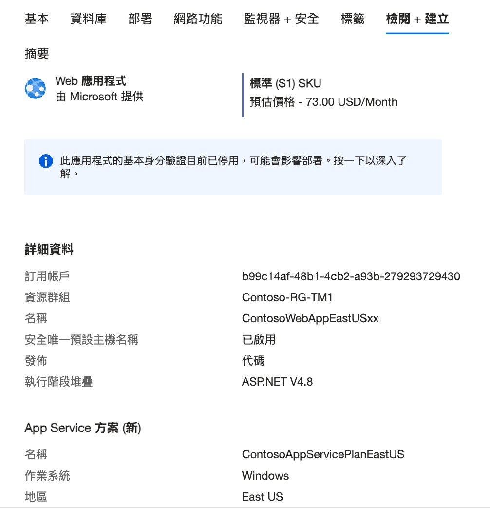

5. 點 **建立**，當 Web 應用程式成功佈建，會建立一個預設網站。

6. 重複 **步驟1~5**，建立第二個 Web 應用程式。

| Setting | Value |
| 資源群組 | 選新建，名稱 Contoso-RG-TM2 |
| 名稱 | ContosoWebAppWestEuropexx (xx 使用你的姓名縮寫讓名稱獨一無二) |
| 地區 | West Europe |
| Windows 方案 (Canada Central) | 建立新項目，名稱 ContosoAppServicePlanWestEurope |

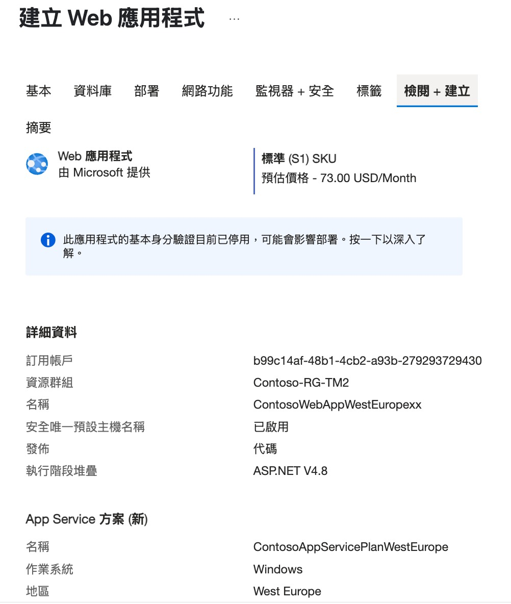

### 任務 2: 建立 流量管理員設定檔

1. 前往 [Azure 入口網站] ，點選搜尋資源、服務及文件 (G+/)，輸入 流量管理。

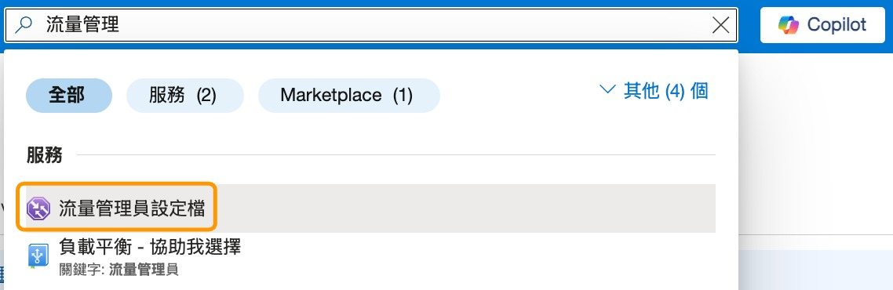

2. 點 建立。

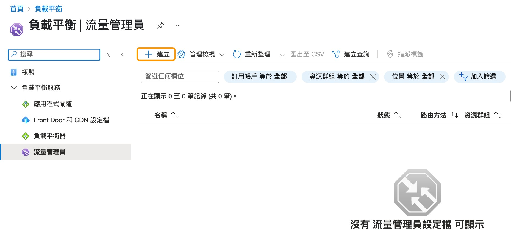

3. 使用下表建立流量管理員設定檔

| Setting | Value |
| 名稱 | Contoso-TMProfilexx (xx 使用你的姓名縮寫讓名稱獨一無二)|
| Routing method | 優先順序 |
| 訂用帳戶 | 你的帳戶 |
| 資源群組 | Contoso-RG-TM1 |
| Resource group location | East US |

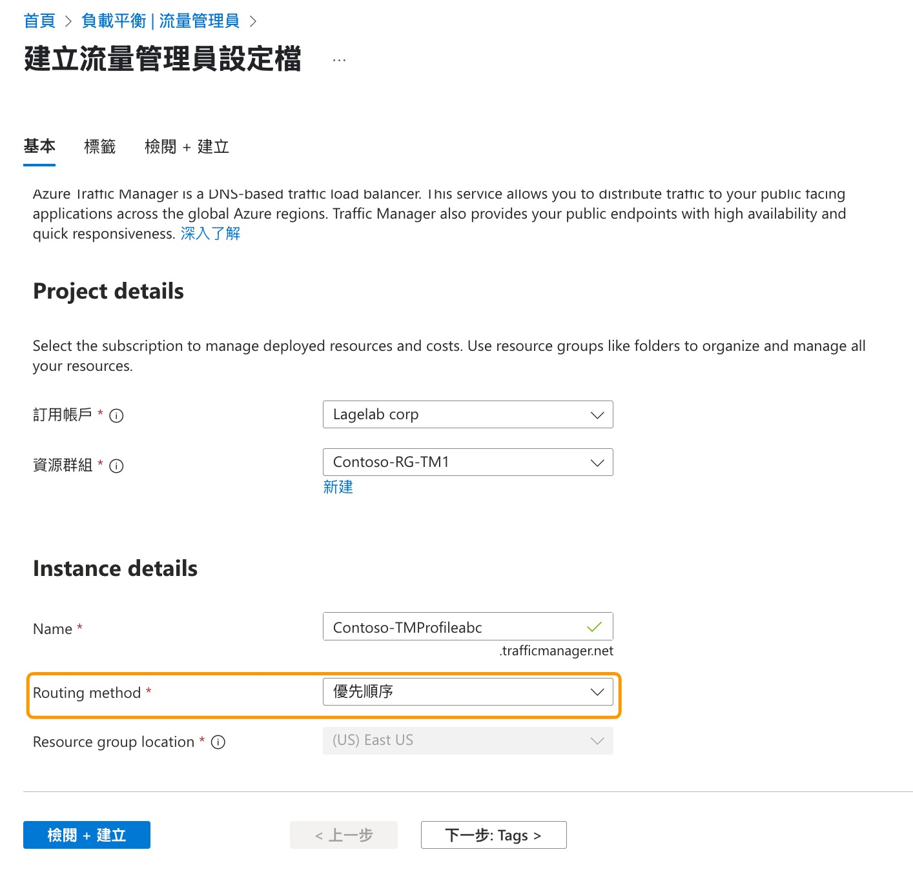

4. 點 建立。
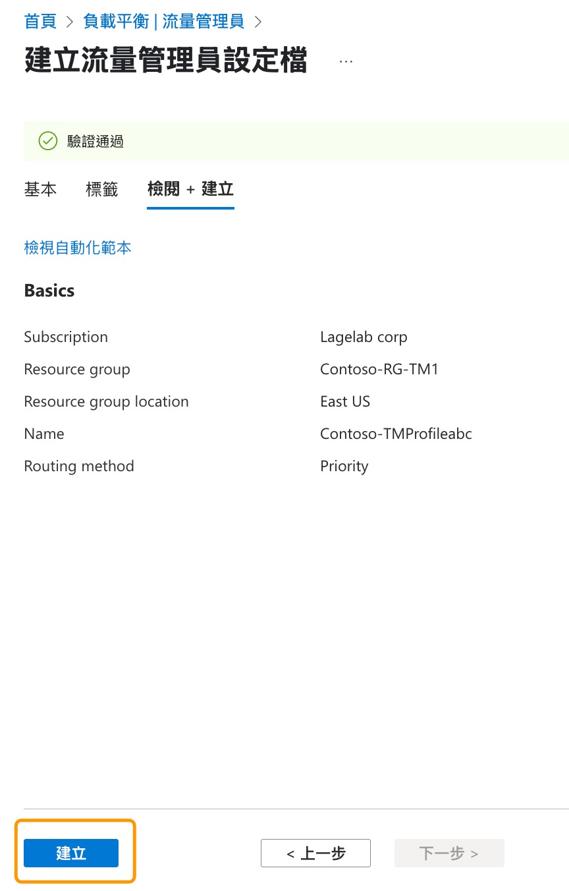

### 任務 3: 新增 流量管理員端點

1. 在 Azure 入口網站首頁上，點 所有資源。在資源列表內 點選 Contoso-TMProfilexx

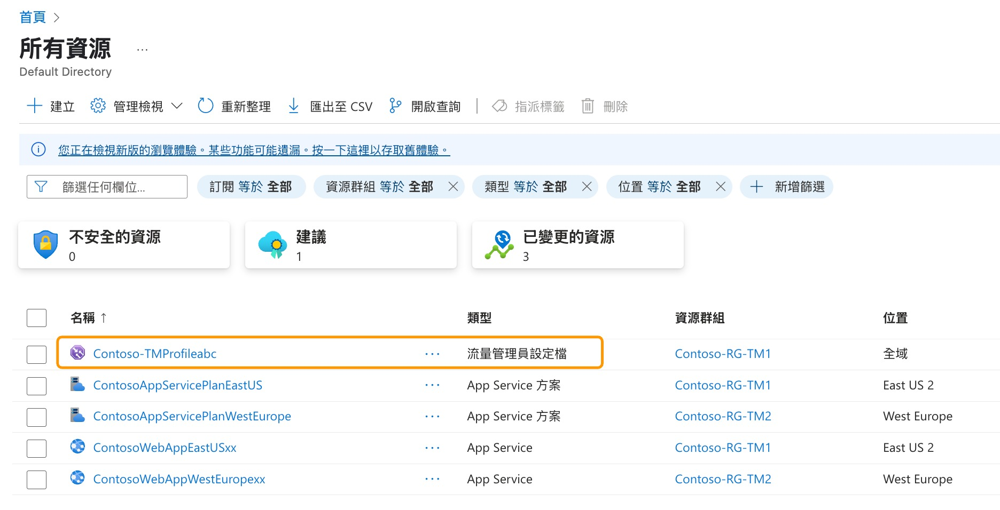

2. 在 settings 下選擇端點。

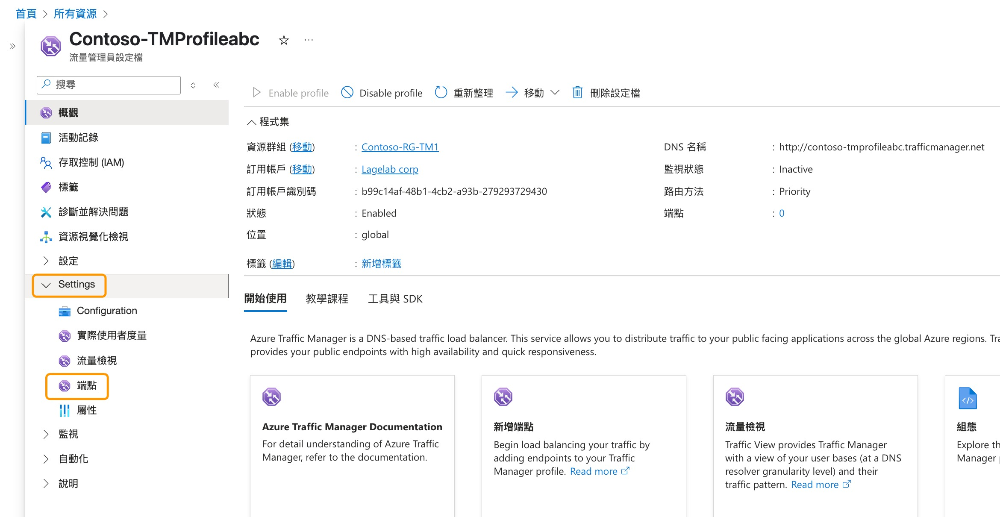

3. 點選新增，依照下表資訊新增端點。

| Setting | Value |
| 類型 | Azure 端點 |
| 名稱 | myPrimaryEndpoint |
| 目標資源類型 | App Service |
| 目標資源 | ContosoWebAppEastUS (East US) |
| 優先順序 | 1 |

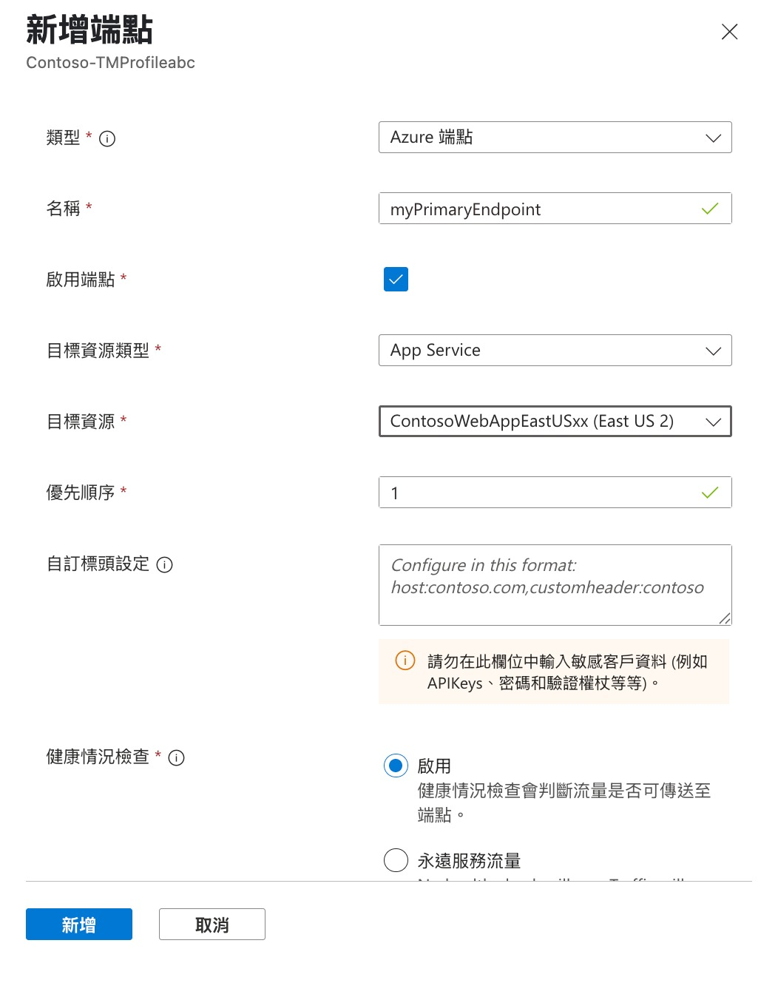

4. 選新增。

5. 重復步驟 2~4 建立 failover 端點。使用相同設定，除下表之資訊。

| Setting | Value |
| 名稱 | myFailoverEndpoint |
| 目標資源 | ContosoWebAppWestEurope (West Europe) |
| 優先順序 | 2 |

6. 優先順序 2 指當設定的主要端點不建康時，流量會轉送到 failover 端點。

7. 在 settings 下，選擇 Configuration，更新端點監視設定的通訊協定為 HTTPS, 連接埠為 443，然後儲存。

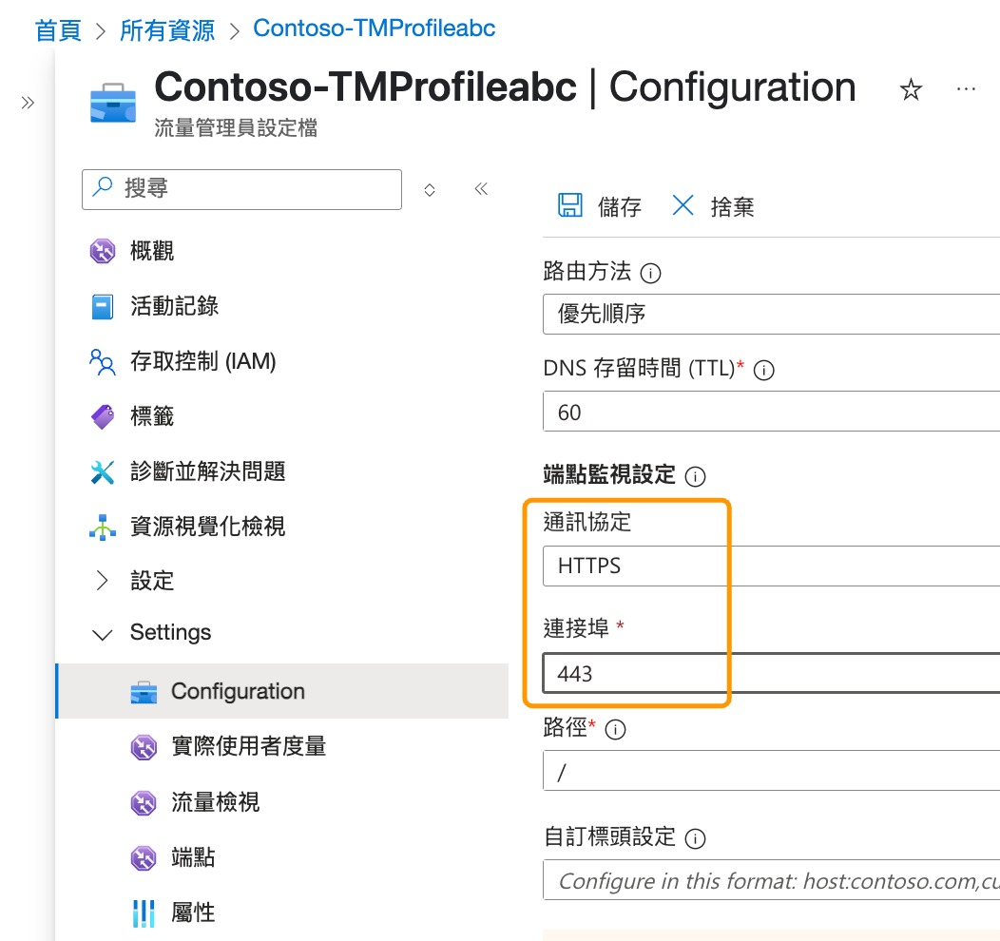

8. 在流量管理員設定檔裡會看到兩個新的端點。需要注意的是，在數分鐘後監視狀態應該變成 Online。

>**說明**:
+ **若使用 Powershell 建立有問題，可使用一般介面建立虛擬機**

### 任務 4: 測試 流量管理員設定檔

1.在 Azure 入口網站首頁上，選擇 **「虛擬機器」**。

2.選擇 **CoreServicesVM**。

3.在 CoreServicesVM 上，選擇 **「連線」>「RDP」**。

4.關於 CoreServicesVM |連接，選擇 **下載 RDP 檔案**。

5.將 RDP 檔案儲存到您的桌面。

6.使用 RDP 檔案以及部署期間提供的使用者名稱TestUser和密碼連線到 CoreServicesVM。

   >**注意**: 密碼為先前建立VM時設定之密碼。

7.在 Azure 入口網站首頁上，選擇 **「虛擬機器」**。

8.選擇 **ManufacturingVM**。

9.在 ManufacturingVM 上，選擇 **「連線」>「RDP」**。

10.在 ManufacturingVM 上|連接，選擇 **下載 RDP 檔案**。

11.將 RDP 檔案儲存到您的桌面。

12.使用 RDP 檔案以及您在部署期間提供的使用者名稱TestUser和密碼連線到 ManufacturingVM。

   >**注意**: 密碼為先前建立VM時設定之密碼。

13.在兩台虛擬機器上的「選擇裝置的隱私設定」中，選擇「接受」。

14.在兩台虛擬機器上的「網路」中，選擇「是」。

15.分別在ManufacturingVM、CoreServicesVM 上，開啟 PowerShell 提示字元並執行下列命令：ipconfig

16.記下 IPv4 位址。

