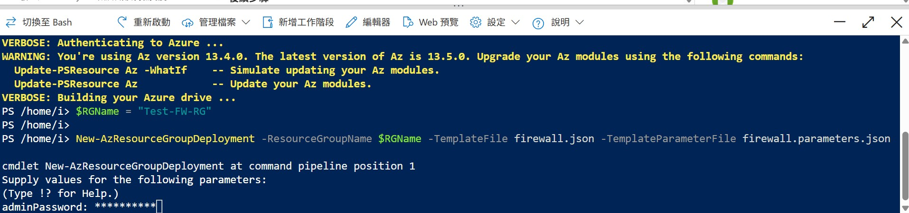

# M06-單元 7：使用 Azure 入口網站部署與設定 Azure 防火牆

## 練習情境

你是 Contoso 公司網路安全小組的一員，負責建立防火牆規則來允許或拒絕對特定網站的存取。本練習將引導你完成環境建立（建立資源群組、虛擬網路與子網路、虛擬機器），接著部署 Azure Firewall 與防火牆原則，設定預設路由、應用程式規則、網路規則、目的NAT(DNAT) 規則，最後進行測試。

地區以**UK South**為例

## 架構圖 


### 練習目標：
1. 建立資源群組  
2. 建立虛擬網路與子網路  
3. 建立虛擬機器  
4. 部署防火牆與防火牆原則  
5. 建立預設路由  
6. 設定應用程式規則  
7. 設定網路規則  
8. 設定目的地 NAT (DNAT) 規則  
9. 修改虛擬機網路介面的 DNS 設定  
10. 測試防火牆規則  

---

## 任務 1：建立資源群組
**在此任務中，您將建立一個新的資源群組**
1. 登入 Azure 入口網站。  
2. 選擇「資源群組」>「建立」。  
   
3. 輸入資源群組名稱：`Test-FW-RG`，選擇區域 UK South。  
4. 點選「檢閱 + 建立」>「建立」。
   


## 任務 2：建立虛擬網路與子網路
**在此任務中，您將建立一個包含兩個子網路的虛擬網路。**
**建立名稱為 `Test-FW-VN` 的虛擬網路，地址空間為 `10.0.0.0/16`。** 
1. 在 Azure 入口網站主頁的搜尋框中，輸入  **虛擬網絡** ，然後在出現時選擇 **「虛擬網路」** 
1. 選擇 **建立**
   
1. 選擇您先前建立的**Test-FW-RG**
1. 在**名稱** 中, 輸入 **Test-FW-VN**
   

**修改預設子網路為 `AzureFirewallSubnet`，子網段 `10.0.1.0/26`**  
1. 選擇 **下一步: IP 位址**。 如果預設尚未輸入 IPv4 位址空間 10.0.0.0/16，請輸入該位址空間。
   
1. **在子網路名稱**下，選擇**Azure Firewall**. **(這邊與微軟原先的選擇不一樣)**
1. **在「編輯子網路」** 對話方塊中，名稱會自動設定為**AzureFirewallSubnet**.
1. **將子網路位址範圍**變更為**10.0.1.0/26**.
1. 點選 **儲存**.
   

**新增子網路 `Workload-SN`，子網段 `10.0.2.0/24`**
1. 點選 **新增子網路**，建立另一個子網，將託管您即將建立的工作負載伺服器
   
1. 在 **編輯子網路** 對話方塊中，將名稱變更為 **Workload-SN**
1. **將子網路位址範圍** 變更為 **10.0.2.0/24**.
1. 點選 **新增**.
   
1. 點選 **檢閱+ 建立**.
   
1. 點選 **建立**.
   


## 任務 3：建立虛擬機器
**在此任務中，您將建立工作負載虛擬機器並將其放置在先前建立的 Workload-SN 子網路中。**
**開啟 Cloud Shell，選擇 PowerShell**  
1. 在 Azure 入口網站中，選擇 Cloud Shell 圖示（右上角）。如果需要，配置 shell。  
    + 選擇 **PowerShell**.
    + 選擇 **不需要任何儲存體帳戶**和您的**訂閱**然後選擇 **套用**.
    + 等待終端機建立並顯示提示 
   
   

**上傳 `firewall.json` 與 `firewall.parameters.json` 檔案** 
1. 在 Cloud Shell 窗格的工具列中，選擇 **「管理檔案」** ，在下拉式選單中選擇 **「上傳」** ，並將下列檔案 **firewall.json** 和 **firewall.parameters.json從來源資料夾F:\Allfiles\Exercises\M06** 逐一上傳到 Cloud Shell 主目錄中
   
   

   >**注意**: 
   + 檔案下載網址: https://github.com/MicrosoftLearning/AZ-700-Designing-and-Implementing-Microsoft-Azure-Networking-Solutions/archive/master.zip
   
    
**執行下列命令部署 VM**
部署以下 ARM 範本來建立此練習所需的 VM： (複製以下code至powershell執行)
   >**注意**: 系統將提示您提供管理員密碼。 (需要 **設定大小寫特殊符號**之密碼，ex:Admin1234!)

   ```powershell
   $RGName = "Test-FW-RG"
   New-AzResourceGroupDeployment -ResourceGroupName $RGName -TemplateFile firewall.json -TemplateParameterFile firewall.parameters.json
   ```
   

   >**注意**: 
   + 執行前需修改微軟連結所提供的**firewall.json** 和 **firewall.parameters.json**內之**vmsize** ，不然後續執行會出現該區域/地區不支援之錯誤
   + 錯誤畫面
   
   + 確認地區可用虛擬機器大小
   
   + 修改內容位置
   

部署成功
   

**部署完成後記下虛擬機器私有 IP（例如：10.0.2.4）**
   
   

## 任務 4：部署防火牆與防火牆原則
**在此任務中，您將把防火牆部署到配置了防火牆策略的虛擬網路**
建立名稱為 `Test-FW01` 的 Azure Firewall，選擇 SKU 為 Standard。  
建立新的防火牆原則 `fw-test-pol`。  
指定虛擬網路為 `Test-FW-VN`，新增公用 IP：`fw-pip`。  
記下防火牆的私有 IP（例如：10.0.1.4）與公用 IP（例如：172.166.159.224）。

1. 在 Azure 入口網站首頁上，選擇 **「建立資源」**，然後在搜尋方塊中輸入  **「防火牆」** 並在出現時選擇 **「防火牆」** 

   
1. **在防火牆** 頁面上，選擇 **建立**

   
1. **在「基本資訊」** 標籤上，使用下表中的資訊建立防火牆

   | **設定**          | **值**                                                    |
   | -------------------- | ------------------------------------------------------------ |
   | 訂閱         | 選擇你的訂閱                                     |
   | 資源群組       | **Test-FW-RG**                                               |
   | 防火牆名稱        | **Test-FW01**                                                |
   | 地區               | UK South                                                  |
   | 防火牆  SKU        | **標準**                                                 |
   | 防火牆管理  | **使用防火牆策略來管理此防火牆**            |
   | 防火牆原則      | 點選**新增**<br />名稱: **fw-test-pol**<br />地區: **UK South** |

   
   
1. 我們不使用防火牆管理器，因此 **取消** 選取 **啟用防火牆管理 NIC** 的方塊
 
   

   | 選擇虛擬網絡 | **使用現有的**                         |
   | ------------------------ | ---------------------------------------- |
   | 虛擬網絡          | **Test-FW-VN**                           |
   | 公用 IP 位址        | 點選**新增**<br />名稱: **fw-pip** |

   
1. 檢查設定 

   
1. 繼續 **檢閱 + 建立**，然後 **建立**.
   
1. 等待防火牆部署完成
1. 防火牆部署完成後，選擇**「前往資源」**.
1. 在**Test-FW01**的**概覽**頁面上，在頁面右側，記下此防火牆的 **防火牆私有 IP** (例如，**10.0.1.4**).
   
1. 在左側選單中，在 **「設定」**下，選擇 **「公用 IP 配置」**.
1. **記下fw-pip** 公用 IP 配置的 **IP 位址** (例如，**172.166.159.224**).
   

## 任務 5：建立預設路由
**在此任務中，在 Workload-SN 子網路上，您將設定出站預設路由以穿過防火牆**
建立名稱為 `Firewall-route` 的路由表，並與 `Workload-SN` 子網路關聯。  
新增路由：  
   - 名稱：`fw-dg`  
   - 地址前綴：`0.0.0.0/0`  
   - 下一跳類型：虛擬設備  
   - 下一跳位址：防火牆私有 IP（10.0.1.4）

1. 在 Azure 入口網站首頁上，選擇 **「建立資源」**，然後在搜尋方塊中輸入**路由**並在出現時選擇 **「路由表」**
   
1. 在 **路由表** 頁面上，選擇 **建立**
   
1. **在「基本資訊」** 標籤上，使用下表中的資訊建立一個新的路由表

   | **設定**              | **值**                |
   | ------------------------ | ------------------------ |
   | 訂閱             | 選擇你的訂閱 |
   | 資源群組           | **Test-FW-RG**           |
   | 地區                   | UK South              |
   | 名稱                     | **Firewall-route**       |
   | 傳播閘道路由 | **Yes**                  |


   
1. 點選 **檢閱 + 建立**
1. 點選 **建立**
   

1. 部署完成後，選擇 **「前往資源」**
   
1. 在 **防火牆路由頁面的「設定」**下，選擇 **「子網路」**，然後選擇 **「關聯」**
1. 在 **虛擬網路**上，選擇 **Test-FW-VN**
1. 在 **子網路上**，選擇**Workload-SN**。確保僅為該路由選擇 Workload-SN 子網，否則防火牆將無法正常運作
1. 點選 **確定**.
   
   

1. 在左邊欄位 **設定**下，點選 **路由**，然後點選 **新增**
1. 在**路由名稱**欄位輸入 **fw-dg**
1. 在**目的地類型**選擇 **IP位址**
1. 在**目的地IP位址/CIDR範圍/位址前綴目標**，輸入**0.0.0.0/0**
1. 在**下一跳/下一個躍點類型**中，選擇 **虛擬設備**
1. 在**下一跳/下一個躍點位址**上，輸入您先前記下的防火牆的私人 IP 位址（例如，**10.0.1.4**)
1. 點選**新增**
    

## 任務 6：設定應用程式規則
**在此任務中，您將新增允許出站存取 <www.google.com> 的應用程式規則。**
編輯防火牆原則 `fw-test-pol` > Application Rules > 新增規則集。  
規則名稱：`App-Coll01`，來源 `10.0.2.0/24`，協定 `http, https`，目的地：`www.google.com`。

1. 在 Azure 入口網站首頁上，選擇 **「所有資源」**
1. 在資源清單中，選擇您的防火牆原則 **fw-test-pol**
   
1. 在**規則**下，選擇 **應用程式規則**
1. 點選 **“新增規則集合”**
   

1. **在「新增規則集合」**頁面上，使用下表中的資訊建立一個新的應用程式規則

   | **設定**            | **值**                                 |
   | ---------------------- | ----------------------------------------- |
   | 名稱                   | **App-Coll01**                            |
   | 規則集合類型   | **應用程式**                           |
   | 優先順序               | **200**                                   |
   | 規則集合動作 | **允許**                                 |
   | 規則集合群組  | **DefaultApplicationRuleCollectionGroup** |
   | **規則部分**      |                                           |
   | 名稱                   | **Allow-Google**                          |
   | 來源類型            | **IP 位址**                            |
   | 來源                 | **10.0.2.0/24**                           |
   | 協定               | **http,https**                            |
   | 目的地類型       | **FQDN**                                  |
   | 目的地            | **<www.google.com>**                        |

1. Select **新增**
   

## 任務 7：設定網路規則
**在此任務中，您將新增一個網路規則，允許對連接埠 53（DNS）的兩個 IP 位址進行出站存取。**
編輯防火牆原則 `fw-test-pol` > Network Rules > 新增規則集。  
規則名稱：`Net-Coll01`，來源 `10.0.2.0/24`，目的地 `209.244.0.3, 209.244.0.4`，協定 UDP 53。

## 任務 8：設定 DNAT 規則
編輯防火牆原則 `fw-test-pol` > DNAT Rules > 新增規則集。  
將公用 IP (如 172.166.159.224) 的 TCP 3389 導向內部虛擬機的 IP (如 10.0.2.4) 的 TCP 3389。

1. 在 **fw-test-pol頁面的「規則」** 下，選擇 **「網路規則」**.
1. 點選 **新增規則集合**.
  

1. **在「新增規則集合」** 頁面上，使用下表中的資訊建立新的網路規則

   | **設定**            | **值**                                                    |
   | ---------------------- | ------------------------------------------------------------ |
   | 名稱                   | **Net-Coll01**                                               |
   | 規則集合類型   | **網路**                                                  |
   | 優先順序               | **200**                                                      |
   | 規則集合動作 | **允許**                                                    |
   | 規則集合群組  | **DefaultNetworkRuleCollectionGroup**                        |
   | **規則部分**      |                                                              |
   | 名稱                   | **Allow-DNS**                                                |
   | 來源類型            | **IP 位址**                                               |
   | 來源                 | **10.0.2.0/24**                                              |
   | 協定               | **UDP**                                                      |
   | 目的地連接埠      | **53**                                                       |
   | 目的地類型       | **IP 位址**                                               |
   | 目的地            | **209.244.0.3, 209.244.0.4**<br />These are public DNS servers operated by Century Link |

1. Select **Add**.
  ​ 

## 任務 9：修改虛擬機 DNS 設定

1. 選擇 VM 的網路介面，在「DNS 伺服器」中選擇「自訂」。  
2. 主 DNS：209.244.0.3，次 DNS：209.244.0.4  
3. 儲存後重啟虛擬機。

## 任務 10：測試防火牆規則

1. 使用遠端桌面連線至防火牆的公用 IP（如 172.166.159.224:3389）。  
2. 登入 `Srv-Work`，開啟瀏覽器瀏覽 `https://www.google.com`（應可開啟）。  
3. 嘗試瀏覽 `https://www.microsoft.com`（應被封鎖）。

## 清除資源

```powershell
Remove-AzResourceGroup -Name 'Test-FW-RG' -Force -AsJob
```

## Copilot 牛刀小試

- Firewall 常見使用情境有哪些？  
- Azure Firewall 各 SKU 的比較表  
- Azure Firewall 三種規則差異（Application、Network、NAT）

## 延伸學習

- [Azure Firewall 簡介](https://learn.microsoft.com/training/modules/introduction-azure-firewall/)  
- [Azure Firewall Manager 簡介](https://learn.microsoft.com/training/modules/intro-to-azure-firewall-manager/)

## 重點整理

- Azure Firewall 是雲端防火牆服務，常與 Hub-Spoke 網路架構搭配使用。  
- 提供 Application、Network、NAT 三種規則。  
- 支援 Standard、Premium、Basic 三種 SKU。
